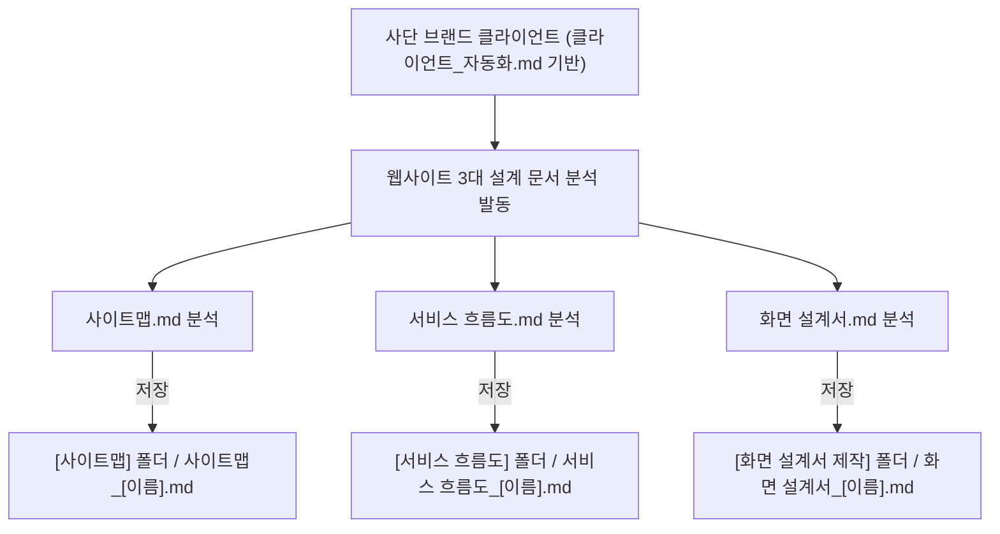

# 클라이언트 웹사이트 생성 스킬 (SKILL.md)

---

## 0. 스킬 개요 및 핵심 원칙
* **스킬 목적:** [`클라이언트_프로세스_자동화.md`](file:///C:/uiux_les/antygravity/%ED%81%B4%EB%9D%BC%EC%9D%B4%EC%96%B8%ED%8A%B8_%EC%9B%B9%EC%82%AC%EC%9D%B4%ED%8A%B8_%EC%83%9D%EC%84%B1.md) 명세에 정의된 3대 웹사이트 설계 문서 분석 및 지정 폴더 저장 자동화 워크플로우를 순차적으로 실행한다.
* **기반 가이드:** `클라이언트_자동화.md` ➔ `클라이언트_프로세스_자동화.md`
* **핵심 원칙:**
  1. **사단 브랜드 맥락 고정:** 대상 클라이언트는 '사단 (士團)' 브랜드 프로젝트 클라이언트 데이터를 기반으로 실행한다.
  2. **1 분석 = 1 파일 (총 3개 독립 파일 생성):** 클라이언트 1명당 사이트맵, 서비스 흐름도, 화면 설계서를 각각 1개씩 총 3개의 독립 md 문서로 생성한다.
  3. **파일명 부착 규칙:** `[분석문서명]_[클라이언트이름].md` 형식 준수 (예: `사이트맵_한유진.md`, `서비스 흐름도_한유진.md`, `화면 설계서_한유진.md`).
  4. **지정 폴더 맵핑 저장:**
     - `사이트맵.md` 분석 ➔ `[사이트맵]` 폴더
     - `서비스 흐름도.md` 분석 ➔ `[서비스 흐름도]` 폴더
     - `화면 설계서.md` 분석 ➔ `[화면 설계서 제작]` 폴더

---

## 1. 실행 프로세스 명세

### [ Step 1 ] 입력 클라이언트 요구사항 확인
1. `가상 클라이언트/클라이언트 모음/클라이언트_[클라이언트이름].md` 및 `클라이언트_분석_[클라이언트이름].md` 파일 탐색
2. 해당 클라이언트의 담당자 역할, 요청사항, 커스텀 조향/마패 헤리티지 관련 핵심 미션 파악

### [ Step 2 ] 문서별 3대 분석 및 파일 생성
1. **사이트맵 생성 (`사이트맵_[이름].md`):**
   - 7~9개 상위 메뉴, 2~3단계 하위 메뉴, 계층적 IA, 정보 유형 지정
   - **저장 위치:** `[사이트맵]` 폴더
2. **서비스 흐름도 생성 (`서비스 흐름도_[이름].md`):**
   - 사용자 진입 ➔ 탐색 ➔ 커스텀 믹싱 ➔ 3D 각인 ➔ 주문/신청 플로우 (Mermaid 포함)
   - **저장 위치:** `[서비스 흐름도]` 폴더
3. **화면 설계서 생성 (`화면 설계서_[이름].md`):**
   - Header, Body, Aside, Footer 5대 영역 배치
   - 10개 이상의 다채로운 콘텐츠 및 10개 이상의 입체적 인터랙션 기능 정의
   - **저장 위치:** `[화면 설계서 제작]` 폴더

---

## 2. 검증 체크리스트

- [ ] 클라이언트 1명당 3개의 독립 파일(`사이트맵`, `서비스 흐름도`, `화면 설계서`)이 생성되었는가?
- [ ] 각 파일 이름 뒤에 `_[클라이언트이름].md` 형식으로 붙었는가?
- [ ] `사이트맵.md` 분석 결과가 `[사이트맵]` 폴더에 저장되었는가?
- [ ] `서비스 흐름도.md` 분석 결과가 `[서비스 흐름도]` 폴더에 저장되었는가?
- [ ] `화면 설계서.md` 분석 결과가 `[화면 설계서 제작]` 폴더에 저장되었는가?
- [ ] '사단' 브랜드 맥락과 다채로운 메뉴/콘텐츠/기능 구조가 반영되었는가?
