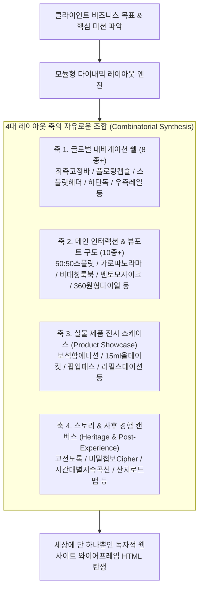

# 📌 클라이언트 기반 웹사이트 시각적 와이어프레임 다이내믹 레이아웃 생성 명세서 (스토리보드.md)

본 문서는 입력받은 **클라이언트 이름(예: 윤서진, 민서준, 임채원, 한유진, 김도현 등)**의 고유한 비즈니스 목표, 타겟 고객 페르소나의 행동 심리, 및 100여 개 실존 뷰티 브랜드 레퍼런스 분석 데이터(`master_references1.txt`, `master_references2.txt`)를 바탕으로, **획일적인 템플릿 반복을 원천 차단하고 매번 세상에 단 하나뿐인 독창적인 다이내믹 레이아웃**의 순수 HTML/CSS 와이어프레임 파일(`[클라이언트이름]_웹사이트_와이어프레임.html`)을 자동 생성하기 위한 마스터 수행 프롬프트 명세서입니다.

---

## 1. 프롬프트 실행 기본 설정

* **입력 파라미터:** `[클라이언트이름]` (예: `민서준`, `임채원`, `윤서진`, `한유진` 등)
* **결과물 저장 폴더:** `스토리보드 결과/` 및 `클라이언트 통합/[클라이언트이름]/5_스토리보드/`
* **생성 파일명:** `[클라이언트이름]_웹사이트_와이어프레임.html`

---

## 2. 클라이언트 기반 입력 참조 파일 자동 로드 규칙

프롬프트 수행 시 입력받은 `[클라이언트이름]`에 해당하는 아래 핵심 기획, 웹페이지 레퍼런스 분석, 및 병합 설계 문서를 작업 폴더에서 읽어와 100% 반영합니다.

1. **클라이언트 기본 브리프:** `가상 클라이언트/클라이언트 모음/클라이언트_[클라이언트이름].md`
2. **클라이언트 분석 보고서:** `가상 클라이언트/클라이언트 분석/클라이언트_분석_[클라이언트이름].md`
3. **브랜드 웹페이지 레퍼런스 분석:** `메모/master_references1.txt` 및 `메모/master_references2.txt`
4. **병합 사이트맵 문서:** `클라이언트 통합/[클라이언트이름]/2_사이트맵/사이트맵_병합_[클라이언트이름].md`
5. **병합 서비스 흐름도 문서:** `클라이언트 통합/[클라이언트이름]/3_서비스_흐름도/서비스_흐름도_병합_[클라이언트이름].md`
6. **병합 화면 설계서 문서:** `클라이언트 통합/[클라이언트이름]/4_화면_설계서/화면_설계서_병합_[클라이언트이름].md`

---

## 3. 핵심 설계 철학: 목적 지향적 설계 & 모듈형 다이내믹 레이아웃 엔진

### 🎯 1. '단순 템플릿 복제' 전면 금지 & '비즈니스 목적 기반 설계'
* **레퍼런스는 외형 복제가 아닌 'UX 해결 도구':** `master_references`의 100여 개 사이트는 껍데기를 베끼기 위한 틀이 아닙니다. 클라이언트가 해결해야 할 핵심 과제(예: 객단가 상승, 3D 각인 소장 가치, 블라인드 구매 장벽 해소, 정기 구독 락인 등)를 가장 마찰 없이 달성하기 위해 검증된 인터랙션 기법을 도구적으로 차용해야 합니다.
* **고정된 6개 틀 폐기 ➔ 무한 조합 시스템:** 소수의 고정된 템플릿에 클라이언트를 끼워 맞추는 방식을 전면 금지하며, 클라이언트의 개성에 맞추어 **4대 아키텍처 축(Axes)**을 새롭게 조합하여 매번 100% 독창적인 DOM 구조와 CSS 그리드를 도출합니다.



---

## 4. 4대 다이내믹 레이아웃 조합 축 (The 4 Architectural Axes)

### 🧭 축 1. 글로벌 내비게이션 & 프레임 쉘 (Navigation Frame Axis)
클라이언트의 톤앤매너와 사용성에 따라 최상위 레이아웃 프레임을 결정합니다:
1. **좌측 세로 고정 바 (Left Fixed 280px):** 이솝, 킨포크 스타일의 정갈하고 깊이 있는 에디토리얼 무드
2. **상단 플로팅 글래스모피즘 캡슐 (Floating Glass Capsule):** SW19, 딥티크 스타일의 모던하고 감각적인 무드
3. **50:50 분할 스플릿 헤더 (50:50 Split Header):** 르 라보, 불리 1803 스타일의 아틀리에 연구소 무드
4. **하단 플로팅 도크 (Bottom Floating Dock):** 모바일 퍼스트 및 직관적 인터랙티브 툴 무드
5. **우측 수직 타임라인 레일 (Right Timeline Rail):** 시간의 흐름이나 다단계 조향 과정에 특화된 네비게이션
6. **상하 분산 미니멀 엣지 바 (Dispersed Edge Navigation):** 하이엔드 오트 쿠튀르 럭셔리 무드

### 🎨 축 2. 메인 인터랙션 & 뷰포트 구도 (Main Hero & Interaction Axis)
사용자가 화면을 조작하고 스크롤할 때의 시각적 경험을 극대화합니다:
1. **좌우 50:50 인터랙티브 스플릿 패널:** 좌측 고정 조향/각인 조작 캔버스 + 우측 스크롤 해설 및 데이터
2. **가로 무한 파노라마 시네마 슬라이더:** 24시간 시간축이나 원료 산지의 흐름을 가로로 펼쳐내는 구조
3. **비대칭 40:60 오버랩 룩북 매거진:** 텍스트와 대형 룩북 컷이 서로 겹치며 깊은 공간감을 주는 구조
4. **파격적 불규칙 벤토 모자이크 (Bento Mosaic):** 1x2, 2x1, 2x2 타일이 유기적으로 맞물리는 조각보형 구조
5. **360도 원형 레이더 / 다이얼 캔버스:** 중앙 마패 오브제를 중심으로 방사형 데이터가 회전하는 뷰포트
6. **아코디언 익스팬더 랙 (Accordion Expander Rack):** 섹션 클릭 시 세로로 부드럽게 펼쳐지는 연구소 서랍형 구조
7. **세로 롱북 에세이 스프레드 (Long-form Book Spread):** 한 편의 시집처럼 활자와 여백이 유려하게 흐르는 구조

### 🎁 축 3. 클라이언트 특화 실물 제품 쇼케이스 (Product Showcase Section)
* 단순한 3열 상자 나열을 금지하며, 클라이언트의 콘셉트(예: 수석 조향사의 3단 보석함, 15ml 올데이 가죽 트래블 키트, 현장 팝업 한정 어사 굿즈, 친환경 알루미늄 리필 스테이션 등)에 맞춘 **독립된 전일 섹션 쇼케이스**를 메인 핵심 영역에 전면 배치합니다.

### 📜 축 4. 스토리 & 사후 경험 캔버스 (Heritage & Post-Experience Axis)
* 조선 암행어사 마패 헤리티지와 고객 락인을 위한 차별화된 기능 섹션:
  1. **조선 24종 자생 원료 고전 백과사전 도록 & 산지 지도**
  2. **비밀 첩보 레시피 증서 발급 및 고유 Cipher Hash 복원 시스템**
  3. **시간대별 발향 지속 곡선 & 12시간 Extrait 25% 부향률 연산 차트**
  4. **24H 5종 디스커버리 테이스팅 킷 & 100% 본품 환급 바우처 센터**

---

## 5. 핵심 레이아웃 리듬감 & 클린 디자인 규칙

### 🌟 1. [1 Section = 1 Single Core Content] 원칙
* **1섹션 1코어 콘텐츠 집중:** 한 섹션 안에 2개 이상의 복잡한 기능(슬라이더 + 각인 + 3D 등)을 억지로 좌우 병렬 배치하여 폼/다이어그램처럼 보이게 만드는 구성을 엄격히 금지합니다. 스크롤에 따라 각 섹션이 화면 전체 뷰포트를 독점하며 단 하나의 명확한 주제/경험에만 온전히 몰입하도록 분리합니다.
* **박스 테두리(`border: 2px solid`) 과다 배제:** 모든 컴포넌트에 테두리선을 둘러싸는 박스 피로도를 제거하고, **시원한 상하 여백(`padding: 90px~110px 0`), 섹션별 배경 톤 교차(White ↔ Light Gray ↔ Dark), 중앙 컨테이너(`max-width: 1200px`)**를 적용하여 실제 상용 브랜드 웹페이지의 고급스러운 리듬감을 구현합니다.

### 🚫 2. 자바스크립트(JS) 전면 제외 규칙
* `<script>` 태그, Inline JS 이벤트(`onclick`, `onmouseover` 등), 외부 JS 라이브러리(jQuery, React, Vue 등) 생성을 전면 금지합니다.
* 오직 순수 **HTML5 시맨틱 구조**와 **Vanilla CSS3 (Flexbox & CSS Grid)**만으로 레이아웃과 시각적 인터페이스를 구현합니다.

### ⛔ 3. #금지 디자인 (Forbidden Design Tropes)
작성 시 아래의 금지 디자인 패턴을 엄격히 배제합니다.
* **금지:** 다크 테마 배경에 보라색/바이올렛 계열 폰트 및 고휘도 네온 글로우 테두리
* **금지:** CSS 그래디언트 텍스트 Fill (Text Gradient Fills)
* **금지:** 의미 없는 아이콘이 무분별하게 채워진 벤토 박스 overuse
* **금지:** 3중 이상 과도하게 중첩된 카드 레이아웃 (Nested Cards)
* **금지:** 외부 이미지 URL 및 실제 사진 파일 삽입 (모두 CSS 그래픽 요소 및 회색 플레이스홀더 영역으로 대체)

### 🔳 4. #출력형태 (Grey-box & Text Only Wireframe)
* **색상 팔레트:** 무채색 및 회색 톤으로만 제한
  * 백그라운드 & 카드: `#ffffff`, `#f8f9fa`, `#f1f5f9`, `#e2e8f0`, `#0f172a`
  * 테두리 & 구분선: `#e2e8f0`, `#cbd5e1`, `#94a3b8`
  * 폰트 & 텍스트: `#0f172a`, `#475569`, `#64748b`, `#ffffff`
* **1:1 회색 박스 매핑:** 화면 설계서에 정의된 10대 이상 콘텐츠와 10대 이상 기능 요소가 선택된 레이아웃 아키텍처의 독립 섹션 회색 박스, 입력 폼, 슬라이더, 아코디언 UI로 100% 매핑 렌더링되어야 합니다.

---

## 6. 수행 프롬프트 템플릿 (Prompt Execution Instruction)

```markdown
[클라이언트 웹사이트 시각적 와이어프레임 자동 생성 프롬프트]

대상 클라이언트 이름: [클라이언트이름]

1. `가상 클라이언트/클라이언트 모음/클라이언트_[클라이언트이름].md`
2. `가상 클라이언트/클라이언트 분석/클라이언트_분석_[클라이언트이름].md`
3. `메모/master_references1.txt` 및 `메모/master_references2.txt`
4. `클라이언트 통합/[클라이언트이름]/2_사이트맵/사이트맵_병합_[클라이언트이름].md`
5. `클라이언트 통합/[클라이언트이름]/3_서비스_흐름도/서비스_흐름도_병합_[클라이언트이름].md`
6. `클라이언트 통합/[클라이언트이름]/4_화면_설계서/화면_설계서_병합_[클라이언트이름].md`

위 6개 입력 파일을 참조하여 '사단(士團)' 브랜드 [클라이언트이름] 담당자의 시각적 와이어프레임 HTML 파일 (`[클라이언트이름]_웹사이트_와이어프레임.html`)을 생성해줘.

작성 조건:
- [획일적 템플릿 복제 절대 금지]: 이전 클라이언트와 동일한 상하 세로 나열 템플릿 사용을 전면 금지하며, [클라이언트이름]의 비즈니스 목표를 해결하기 위한 독창적인 DOM 구조와 CSS 그리드를 새롭게 합성
- [4대 아키텍처 축 다이내믹 조합]: 내비게이션 쉘, 메인 인터랙션 구도, 실물 제품 쇼케이스, 스토리 캔버스를 클라이언트 콘셉트에 맞게 융합
- [1 Section = 1 Single Core Content]: 1개 섹션당 1개의 핵심 경험 집중 및 상하 여백(padding: 90px~110px 0)과 배경 톤 교차 적용
- [전용 제품 쇼케이스 필수 포함]: 클라이언트 콘셉트에 맞춘 실물 제품/키트 전면 쇼케이스 배치
- [자바스크립트(JS) 제외]: script 태그 없이 순수 HTML5 + Vanilla CSS3 시맨틱 구조로만 구현
- [#금지 디자인 준수]: 네온 글로우 테두리, 보라색 다크폰트, 그래디언트 텍스트 배제
- [#출력형태 준수]: 무채색 회색 박스(Grey-box)와 글자(Text) 중심 저/중충실도 와이어프레임 렌더링
- [저장 위치]: `스토리보드 결과/[클라이언트이름]_웹사이트_와이어프레임.html` 및 `클라이언트 통합/[클라이언트이름]/5_스토리보드/`
```
