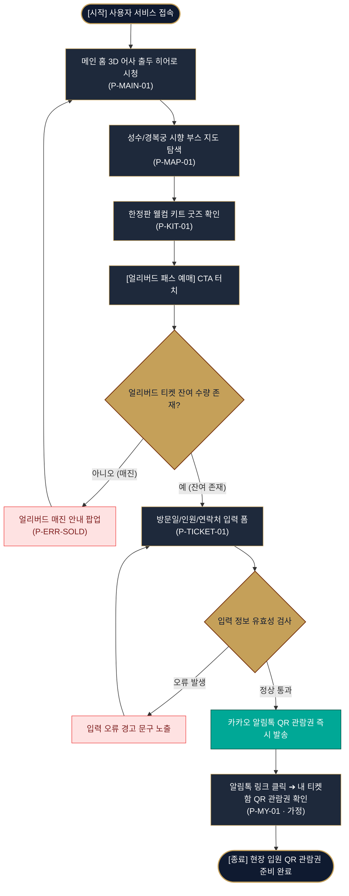

# 사단 어사 출두 K-헤리티지 향 페스티벌 서비스 흐름도 (윤태양)

---

## 1. 서비스 흐름 개요
- **프로젝트명:** 사단 어사 출두 K-헤리티지 향 페스티벌 & 팝업 패스 웹사이트
- **총괄 디렉터:** 윤태양 (사단 어사 출두 페스티벌 총괄 디렉터)
- **목적:** 3D 어사 출두 모션 히어로 탐색부터 성수/경복궁 시향 부스 지도 확인, 1,000명 한정 얼리버드 패스 예매 및 카카오 알림톡 QR 관람권 발급까지의 전 과정을 시각화.

---

## 2. 사용자 유형과 시작 조건
- **사용자 유형:**
  - **일반 관람객 (비회원):** 페스티벌 세계관 탐색, 시향 부스 위치/타임테이블 확인, 얼리버드 패스 사전 예매 신청자
  - **예매 완료 회원 (가정):** 카카오톡 알림톡 링크를 통해 현장 수령 QR 관람권을 조회하는 예매 완료자
- **시작 조건:** 모바일/PC 브라우저를 통한 메인 홈(`P-MAIN-01`) 접속 또는 SNS 룩북 링크를 통한 사전 예매 모달 직접 진입.

---

## 3. 핵심 정상 흐름 (Happy Path)
```text
[시작: 메인 홈 접속 (P-MAIN-01)]
  ↓
[3D 어사 출두 히어로 비디오 시청 & 사운드 토글]
  ↓
[성수/경복궁 시향 부스 지도 UI 탐색 (P-MAP-01)]
  ↓
[마패 핀 클릭 ➔ 아로마 향 노트 팝업 확인]
  ↓
[한정판 웰컴 키트 굿즈 갤러리 확인 (P-KIT-01)]
  ↓
[얼리버드 패스 예매 CTA 클릭 (P-TICKET-01)]
  ↓
[방문 일자 & 티켓 수량 선택 (최대 4매)]
  ↓
[예매자 성함 & 연락처 입력]
  ↓
[예매 완료 ➔ 카카오 알림톡 QR 관람권 즉시 발송]
  ↓
[종료: 현장 입원 QR 모바일 관람권 수령 (P-MY-01)]
```

---

## 4. 분기, 오류, 이탈, 재진입 흐름

### A. 입력값 오류 분기 (Validation Error)
- **상황:** 예매자 연락처 자릿수 미달 또는 예매 수량 미선택 시 발생.
- **처리:** 예매 모달 내 경고 메시지 노출("올바른 10자 이상의 연락처를 입력해주세요") ➔ 입력 폼 유지 ➔ 재입력 완료 시 예매 진행.

### B. 얼리버드 한정 수량 소진 (Sold Out Exception)
- **상황:** 1,000명 얼리버드 한정 티켓이 조기 매진된 경우.
- **처리:** '얼리버드 매진 안내 팝업(P-ERR-SOLD)' 노출 ➔ 취소표 발생 알림 신청 폼 연결 ➔ 메인 홈으로 원위치 복구.

### C. 유효하지 않은 경로 진입 (404 Not Found)
- **상황:** 잘못된 URL 또는 삭제된 팝업 페이지 접근 시.
- **처리:** '404 페이지 없음(P-ERR-404)' 안내 노출 ➔ [메인 홈으로 이동] 버튼 제공 ➔ 메인 홈(`P-MAIN-01`) 안전 재진입.

---

## 5. 단계별 사용자 행동, 시스템 처리, 화면, 다음 조건 정리 표

| 단계 | 사용자 행동 | 시스템 처리 | 화면 ID (화면명) | 다음 진행 조건 |
| :---: | :--- | :--- | :--- | :--- |
| **1** | 서비스 접속 및 스크롤 | 3D 어사 출두 모션 로딩 및 헤더 GNB 노출 | **P-MAIN-01** (메인 홈) | 3D 비디오 재생 완료 |
| **2** | 시향 부스 지도 마패 핀 터치 | 해당 위치(성수/경복궁) 아로마 향 노트 데이터 검색 | **P-MAP-01** (Timetable & Map) | 향 노트 팝업 닫기 또는 예매 클릭 |
| **3** | 웰컴 키트 굿즈 슬라이더 탭 | 마패 뱃지 및 패브릭 노리개 고화질 컷 렌더링 | **P-KIT-01** (Welcome Kit) | [패스 예매하기] CTA 터치 |
| **4** | 얼리버드 패스 예매 CTA 터치 | 예매 가능 수량 카운트다운 확인 및 모달 레이어 팝업 | **P-TICKET-01** (Pass Ticket) | 일자/수량 선택 완료 |
| **5** | 예매자 정보 입력 & [제출] | 입력 유효성 검사 ➔ 카카오 알림톡 API 호출 | **P-TICKET-01** (예매 모달) | 유효성 통과 시 결제/발송 완료 |
| **6** | 알림톡 메세지 링크 클릭 | 현장 입원 QR 모바일 관람권 렌더링 | **P-MY-01** (내 티켓함 · 가정) | 현장 수령 완료 (종료) |

---

## 6. Mermaid Flowchart 서비스 흐름도


