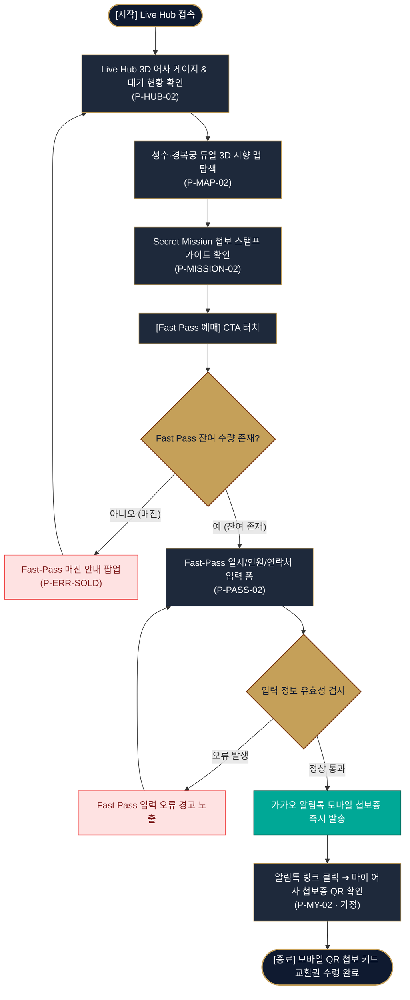

# 사단 어사 출두 K-헤리티지 향 페스티벌 서비스 흐름도 v2 (윤태양 - 대안 구조)

---

## 1. 서비스 흐름 개요 (Option B 대안 구조)
- **프로젝트명:** 사단 어사 출두 K-헤리티지 향 페스티벌 & 성수/경복궁 팝업 패스 웹사이트
- **총괄 디렉터:** 윤태양 (사단 어사 출두 페스티벌 총괄 디렉터)
- **차별화 렌즈 (v2):** 현장 스탬프 퀘스트 및 Fast-Pass 모바일 입장권 교환을 지원하는 **'디지털 모바일 컴패니언 흐름 (Digital Companion Flow)'** 전용 대안 구조.

---

## 2. 사용자 유형과 시작 조건
- **사용자 유형:**
  - **스탬프 퀘스트 참가자 (비회원):** Live Hub 접속, 첩보 미션 수행, 듀얼 시향 맵 확인, Fast-Pass 티케팅 신청자
  - **Fast-Pass 입장객 (회원 · 가정):** 카카오 알림톡 링크를 통해 모바일 QR 첩보 키트 교환권을 조율하는 방문객
- **시작 조건:** Live Hub(`P-HUB-02`) 접속 또는 인스타그램 룩북 링크를 통한 Fast-Pass 모달 직접 진입.

---

## 3. 핵심 정상 흐름 (Happy Path - v2 대안)
```text
[시작: Live Hub 접속 (P-HUB-02)]
  ↓
[3D 어사 출두 게이지 & 실시간 현장 대기 현황 확인]
  ↓
[성수/경복궁 듀얼 3D 시향 맵 탐색 (P-MAP-02)]
  ↓
[Secret Mission 첩보 스탬프 퀘스트 브리핑 확인 (P-MISSION-02)]
  ↓
[Fast-Pass 얼리버드 예매 CTA 클릭 (P-PASS-02)]
  ↓
[방문 일자 & Fast-Pass 수량 선택 (최대 4매)]
  ↓
[예매자 성함 & 연락처 입력 ➔ 유효성 통과]
  ↓
[Fast-Pass 발급 ➔ 카카오 알림톡 모바일 첩보증 즉시 발송]
  ↓
[종료: 마이 어사 첩보증 QR 키트 교환권 수령 완료 (P-MY-02 · 가정)]
```

---

## 4. 분기, 오류, 이탈, 재진입 흐름 (v2 대안)

### A. Fast-Pass 입력 유효성 오류 (Validation Error)
- **상황:** 연락처 자릿수 미달 또는 방문 일시 미선택 시.
- **처리:** Fast-Pass 모달 내 경고 노출("올바른 연락처 및 방문 일시를 선택해주세요") ➔ 입력 폼 유지 ➔ 재입력 시 정상 진행.

### B. Fast-Pass 1,000명 조기 매진 (Sold Out Exception)
- **상황:** 한정 Fast-Pass 티켓이 모두 소진된 경우.
- **처리:** 'Fast-Pass 매진 안내 팝업(P-ERR-SOLD)' 노출 ➔ 취소표 대기 알림톡 신청 ➔ Live Hub 메인 복구.

### C. 유효하지 않은 경로 진입 (404 Not Found)
- **상황:** 잘못된 링크 또는 미션 팝업 오류 접근 시.
- **처리:** '404 페이지 없음(P-ERR-404)' 안내 노출 ➔ [Live Hub 복구] 버튼 터치 ➔ 메인 현황(`P-HUB-02`) 복구.

---

## 5. 단계별 사용자 행동, 시스템 처리, 화면, 다음 조건 정리 표 (v2 대안)

| 단계 | 사용자 행동 | 시스템 처리 | 화면 ID (화면명) | 다음 진행 조건 |
| :---: | :--- | :--- | :--- | :--- |
| **1** | Live Hub 접속 및 3D 게이지 터치 | 현장 실시간 대기 현황 및 팝업 안내 노출 | **P-HUB-02** (Live Hub) | 듀얼 시향 맵 탭 이동 |
| **2** | 성수/경복궁 듀얼 맵 마패 핀 터치 | 1·2·3 마패 아로마 향 노트 팝업 렌더링 | **P-MAP-02** (Dual Fragrance Map) | 첩보 미션 확인 클릭 |
| **3** | Secret Mission 미션 가이드 확인 | K-헤리티지 스탬프 퀘스트 브리핑 노출 | **P-MISSION-02** (Secret Mission) | [Fast Pass 예매] CTA 클릭 |
| **4** | Fast Pass 예매 CTA 터치 | 1,000명 한정 수량 카운트다운 & 예매 모달 노출 | **P-PASS-02** (Fast Pass Ticket) | 일시/수량 입력 완료 |
| **5** | 예매자 정보 입력 & [제출] | 유효성 검사 ➔ 카카오 알림톡 발송 API 연동 | **P-PASS-02** (예매 모달) | 유효성 통과 시 즉시 발송 |
| **6** | 알림톡 메세지 링크 터치 | 모바일 QR 첩보 키트 교환권 렌더링 | **P-MY-02** (마이 어사 첩보증 · 가정) | 현장 수령 완료 (종료) |

---

## 6. Mermaid Flowchart 서비스 흐름도 (v2 대안)


