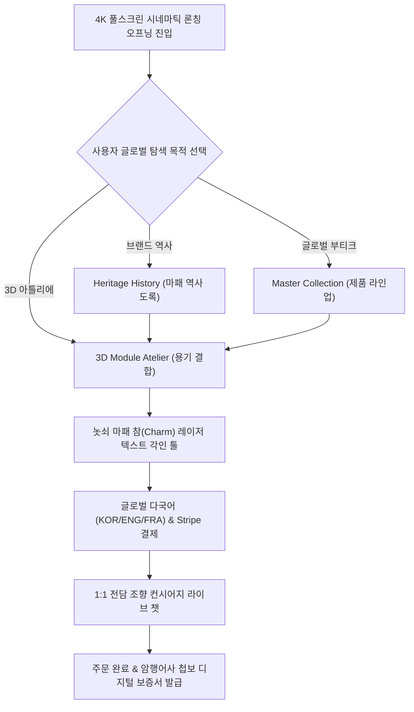

# 📌 서비스 흐름도 N개 시안 기획 & 최적 병합 보고서 (서비스_흐름도_병합_윤서진.md)

본 문서는 사단(士團) 브랜드 **윤서진 (글로벌 럭셔리 브랜드 총괄 디렉터)**의 개별 시안 3종(시안 1~3)을 비교하여 이탈률을 최소화한 최종 최적 병합 서비스 흐름도 보고서입니다.

---

## 1. 개별 시안 3종(Ver 1~3) 비교 요약
- **시안 1 (서사 탐색형):** 시네마틱 영상 ➔ 역사 도록 ➔ 결제 (몰입감 높음)
- **시안 2 (3D 아틀리에형):** 3D 용기 각인 ➔ 즉시 결제 (전환율 높음)
- **시안 3 (VIP 보증서형):** 시리얼 인증 ➔ 1:1 컨시어지 ➔ 주문 (럭셔리 재구매)
- **▶ 최적 병합 결론:** 4K 시네마틱 오프닝 ➔ 3D 용기 결합 ➔ 레이저 각인 UI ➔ 다국어 결제 ➔ 첩보 보증서 자동 발급 유저 플로우 도출.

---

## 2. 최적 병합 서비스 흐름도 (Optimal Merged Flowchart)

