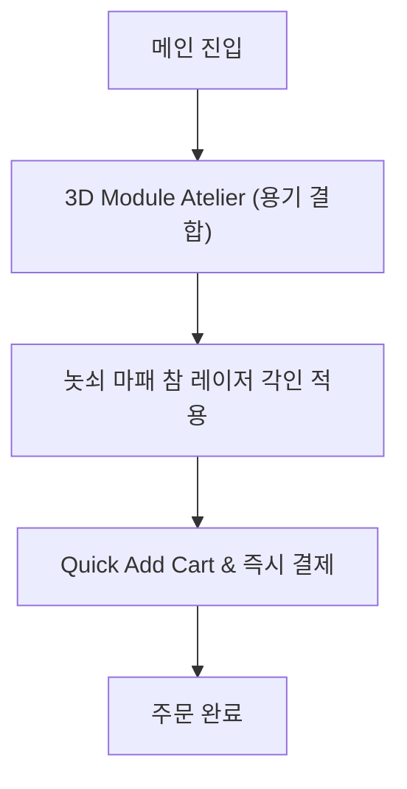

# 📌 [사단(士團)] 윤서진 클라이언트 서비스 흐름도 시안 2 (서비스_흐름도_시안2_윤서진.md)

## 1. 시안 개요: 3D 모듈 아틀리에 직행 플로우 (Ver 2)
- **특징:** 메인 진입 직후 3D 용기 결합 뷰어 및 각인 툴로 이동하여 빠르게 구매를 유도하는 커머스 플로우.

```mermaid
flowchart TD
    A["메인 진입"] --> B["3D Module Atelier (용기 결합)"]
    B --> C["놋쇠 마패 참 레이저 각인 적용"]
    C --> D["Quick Add Cart & 즉시 결제"]
    D --> E["주문 완료"]
```
