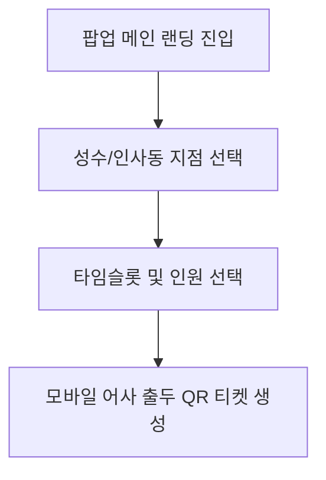

# 📌 [사단(士團)] 강현우 클라이언트 서비스 흐름도 시안 1 (서비스_흐름도_시안1_강현우.md)

## 1. 사전 예약 직행 유저플로우 (Ver 1)

```mermaid
flowchart TD
    A["팝업 메인 랜딩 진입"] --> B["성수/인사동 지점 선택"]
    B --> C["타임슬롯 및 인원 선택"]
    C --> D["모바일 어사 출두 QR 티켓 생성"]
```
