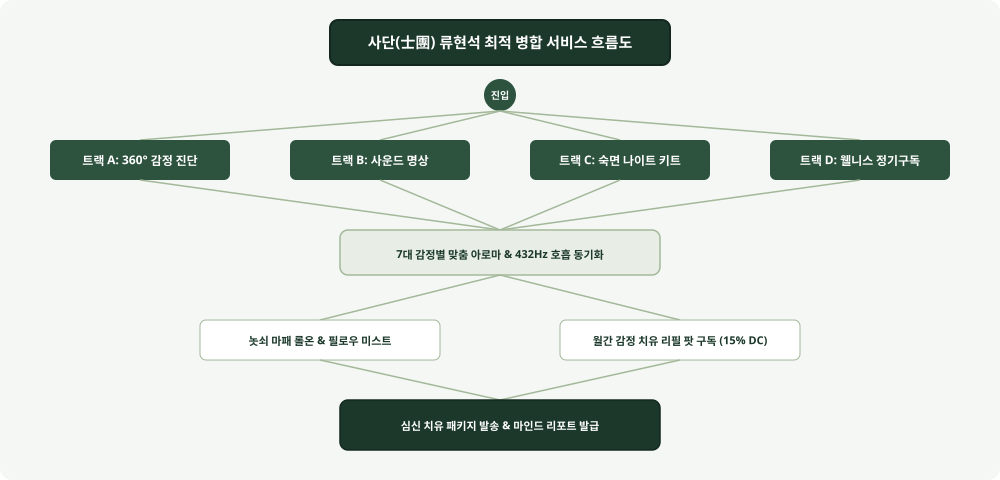

# 📌 [서비스 흐름도 최적 병합] 류현석 (오리엔탈 웰니스 & 아로마테라피 명상 마스터)

---

## 1. 4대 진입 트랙 (Entry Tracks)
1. **Track A (감정 자가진단 트랙):** 360° 감정 휠 ➔ 7대 감정 선택 ➔ 맞춤 아로마 롤온
2. **Track B (싱잉볼 사운드 트랙):** 432Hz 명상 음원 ➔ 4-4-6 호흡 리추얼 ➔ 필로우 미스트
3. **Track C (숙면 나이트 패키지 트랙):** 롤온 + 미스트 + 삼베 안대 ➔ 나이트 세트 구매
4. **Track D (월간 정기구독 트랙):** 계절 맞춤 팟 ➔ 감정 리포트 ➔ 정기배송 등록

---

## 2. 5대 조건부 판단 분기 ({?})
* **Branch 1 {주요 고민 상태?}:** [스트레스/분노] vs [불안/초조] vs [불면/피로] vs [우울/무기력]
* **Branch 2 {선호 제형?}:** [맥박에 바르는 놋쇠 롤온] vs [베개에 뿌리는 필로우 미스트]
* **Branch 3 {사운드스케이프 재생?}:** [432Hz 싱잉볼 ON] vs [음소거 텍스트 가이드]
* **Branch 4 {패키징 형태?}:** [풀패키지 삼베 세트] vs [단품 카트리지]
* **Branch 5 {구매 방식?}:** [1회 단품 구매] vs [월간 정기구독 15% 할인]

---

## 3. 4대 예외 및 실패 복구 루프 (Fallback Loops)
* **Loop 1 (사운드 재생 오류 시):** 텍스트 기반 호흡 가이드 및 심호흡 타이머로 즉각 전환
* **Loop 2 (피부 민감 고객 문의):** 전성분 EWG 올그린 및 피부 저자극 임상 보고서 팝업 안내
* **Loop 3 (구독 주기 변경 희망 시):** 카카오톡 챗봇으로 배송 주기(1/2/3개월) 즉시 변경 지원
* **Loop 4 (정기구독 결제 실패 시):** 7일간 리필 카트리지 보관 및 간편 대체 결제 안내
