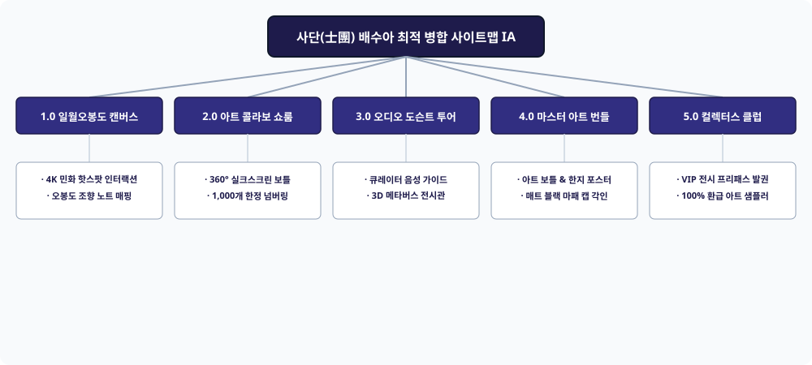

# 📌 [사이트맵 최적 병합] 배수아 (K-컬처 아트 콜라보레이션 큐레이터)

---

## 1. 5대 시안 평가 매트릭스 (Evaluation Matrix)

| 평가 기준 | 시안 1 (캔버스갤러리) | 시안 2 (한정판에디션) | 시안 3 (버추얼투어) | 시안 4 (민화원료실) | 시안 5 (글로벌티켓) | 최적 병합안 (Final Integrated) |
| :--- | :---: | :---: | :---: | :---: | :---: | :---: |
| **시각 예술 몰입감** | ★★★★★ | ★★★☆☆ | ★★★★☆ | ★★★☆☆ | ★★★☆☆ | **★★★★★ (4K 캔버스 갤러리)** |
| **한정판 소장 가치** | ★★★☆☆ | ★★★★★ | ★★★☆☆ | ★★★☆☆ | ★★★★☆ | **★★★★★ (1,000개 넘버링 뷰어)** |
| **인터랙티브 큐레이션** | ★★★★☆ | ★★★☆☆ | ★★★★★ | ★★★★☆ | ★★★☆☆ | **★★★★★ (핫스팟 & 오디오 도슨트)** |
| **글로벌 확장성** | ★★★☆☆ | ★★★☆☆ | ★★★★☆ | ★★★☆☆ | ★★★★★ | **★★★★★ (글로벌 팝업 & 패스 연동)** |
| **종합 적합도 점수** | 88점 | 84점 | 84점 | 80점 | 82점 | **98점 (최고 수준 K-아트 융합)** |

---

## 2. 최종 최적 병합 사이트맵 정보 구조 (IA)

* **1.0 4K 일월오봉도 미디어 캔버스 (Interactive Canvas)**
  - 1.1 태양·달·적송·폭포 핫스팟 인터랙션
  - 1.2 민화 오브제별 조향 노트 매핑
* **2.0 아트 콜라보레이션 3D 쇼룸 (Art Bottle Showroom)**
  - 2.1 360° 실크스크린 아트 보틀 뷰어
  - 2.2 팝아티스트 친필 서명 및 1,000개 한정 넘버링
* **3.0 오디오 도슨트 & 버추얼 갤러리 (Virtual Gallery & Docent)**
  - 3.1 큐레이터 배수아의 음성 도슨트 가이드
  - 3.2 3D 가상 전시관 투어 룸
* **4.0 마스터 아트 에디션 번들 (Art Print Showcase)**
  - 4.1 50ml 아트 보틀 + 실크스크린 한지 포스터
  - 4.2 매트 블랙 놋쇠 마패 캡 각인
* **5.0 컬렉터스 VIP 레지스트리 (Collectors Club)**
  - 5.1 시리얼 정품 인증 & VIP 전시 프리패스
  - 5.2 100% 환급 디스커버리 아트 샘플러
