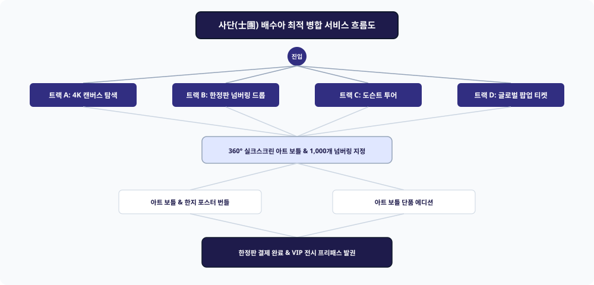

# 📌 [서비스 흐름도 최적 병합] 배수아 (K-컬처 아트 콜라보레이션 큐레이터)

---

## 1. 4대 진입 트랙 (Entry Tracks)
1. **Track A (4K 인터랙티브 캔버스 트랙):** 일월오봉도 핫스팟 탐색 ➔ 조향 노트 매핑 ➔ 3D 아트 보틀
2. **Track B (1,000개 한정 드롭 트랙):** 넘버링 번호 픽커 ➔ 아티스트 친필 서명 확인 ➔ 한정판 구매
3. **Track C (버추얼 도슨트 투어 트랙):** 3D 가상 전시관 투어 ➔ 음성 도슨트 청취 ➔ 전시 굿즈샵
4. **Track D (글로벌 팝업 & VIP 트랙):** 서울/파리 팝업 예약 ➔ 모바일 QR 패스 ➔ 현장 한정판 수령

---

## 2. 5대 조건부 판단 분기 ({?})
* **Branch 1 {갤러리 감상 모드?}:** [4K 민화 캔버스 핫스팟] vs [3D 메타버스 전시 투어]
* **Branch 2 {오디오 도슨트 청취?}:** [큐레이터 음성 해설 ON] vs [텍스트 큐레이션]
* **Branch 3 {아트 보틀 넘버링 선택?}:** [선호 시리얼 지정 (예: #088)] vs [자동 랜덤 배정]
* **Branch 4 {패키징 구성?}:** [아트 프린트 포스터 동봉 번들] vs [아트 보틀 단품]
* **Branch 5 {VIP 전시 패스?}:** [오프라인 팝업 패스 포함] vs [온라인 직배송]

---

## 3. 4대 예외 및 실패 복구 루프 (Fallback Loops)
* **Loop 1 (선택한 넘버링 중복 선점 시):** 실시간 가용 넘버링 목록 자동 추천 팝업
* **Loop 2 (오디오 스트리밍 지연 시):** 텍스트 도슨트 스크립트 모달 즉시 노출
* **Loop 3 (3D WebGL 미지원 기기 접속 시):** 4K 고화질 2D 갤러리 룩북으로 자동 폴백
* **Loop 4 (아트 포스터 파손 대비):** 하드 튜브 케이스 2중 안심 패키징 기본 적용
