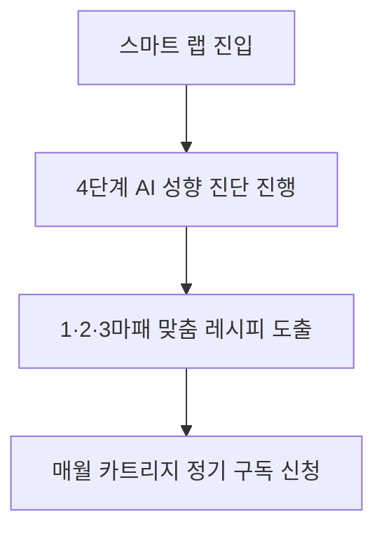

# 📌 [사단(士團)] 백소율 클라이언트 서비스 흐름도 시안 1 (서비스_흐름도_시안1_백소율.md)

## 1. AI 조향 진단 & 나만의 레시피 구독 플로우 (Ver 1)

```mermaid
flowchart TD
    A["스마트 랩 진입"] --> B["4단계 AI 성향 진단 진행"]
    B --> C["1·2·3마패 맞춤 레시피 도출"]
    C --> D["매월 카트리지 정기 구독 신청"]
```
