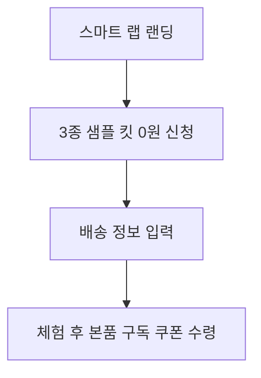

# 📌 [사단(士團)] 백소율 클라이언트 서비스 흐름도 시안 2 (서비스_흐름도_시안2_백소율.md)

## 1. 디스커버리 샘플 킷 신청 직행 플로우 (Ver 2)

```mermaid
flowchart TD
    A["스마트 랩 랜딩"] --> B["3종 샘플 킷 0원 신청"]
    B --> C["배송 정보 입력"]
    C --> D["체험 후 본품 구독 쿠폰 수령"]
```
