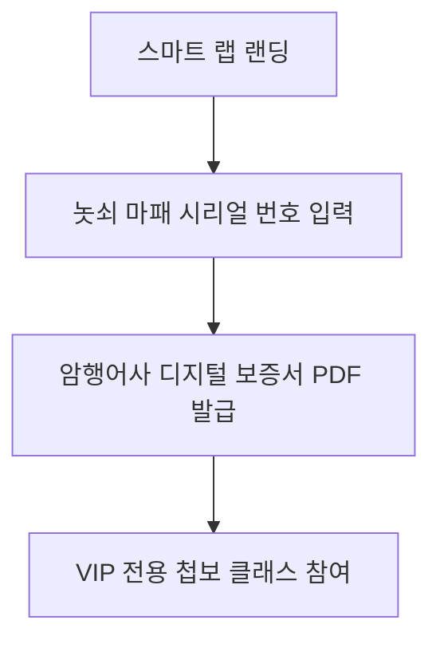

# 📌 [사단(士團)] 백소율 클라이언트 서비스 흐름도 시안 3 (서비스_흐름도_시안3_백소율.md)

## 1. 디지털 시리얼 보증서 등록 & 멤버십 회원 플로우 (Ver 3)

```mermaid
flowchart TD
    A["스마트 랩 랜딩"] --> B["놋쇠 마패 시리얼 번호 입력"]
    B --> C["암행어사 디지털 보증서 PDF 발급"]
    C --> D["VIP 전용 첩보 클래스 참여"]
```
