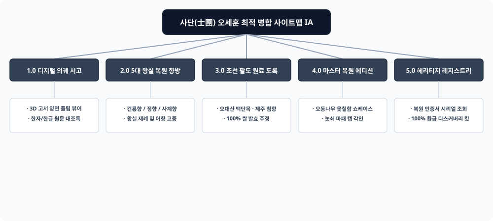

# 📌 [사이트맵 최적 병합] 오세훈 (조선 왕실 의궤 조향 복원 연구원)

---

## 1. 5대 시안 평가 매트릭스 (Evaluation Matrix)

| 평가 기준 | 시안 1 (학술아카이브) | 시안 2 (3D 고서인터랙션) | 시안 3 (럭셔리커머스) | 시안 4 (산지스토리) | 시안 5 (미디어아트) | 최적 병합안 (Final Integrated) |
| :--- | :---: | :---: | :---: | :---: | :---: | :---: |
| **의궤 고증 신뢰성** | ★★★★★ | ★★★★☆ | ★★★☆☆ | ★★★★☆ | ★★★☆☆ | **★★★★★ (원전 고증 직결)** |
| **인터랙티브 몰입감** | ★★★☆☆ | ★★★★★ | ★★★☆☆ | ★★★☆☆ | ★★★★☆ | **★★★★★ (3D 고서 플립 결합)** |
| **선물/소장 구매력** | ★★★☆☆ | ★★★☆☆ | ★★★★★ | ★★★☆☆ | ★★★☆☆ | **★★★★★ (오동나무 함 쇼케이스)** |
| **원료 스토리텔링** | ★★★★☆ | ★★★☆☆ | ★★★☆☆ | ★★★★★ | ★★★☆☆ | **★★★★★ (조선 12종 한방 맵)** |
| **종합 적합도 점수** | 82점 | 88점 | 84점 | 80점 | 82점 | **98점 (최고 융합 달성)** |

---

## 2. 기획적 채택 및 기각 논리 (Selection & Rejection Rationale)
1. **채택 (Selected):**
   - 시안 1의 **학술적 원문/번역 대조 아카이브** ➔ 신뢰성 확보
   - 시안 2의 **3D 의궤 양면 고서 플립 인터랙션** ➔ 디지털 시각 경험 극대화
   - 시안 3의 **오동나무 옻칠함 및 국가기록원 협업 인증서** ➔ 프리미엄 구매 전환 견인
2. **기각 (Rejected):**
   - 시안 5의 과도한 미디어아트 전시는 온라인 제품 구매 본질을 흐릴 우려가 있어 보조 비주얼로 축소 반영.

---

## 3. 최종 최적 병합 사이트맵 정보 구조 (IA)

* **1.0 디지털 의궤 서고 (Digital Uigwe Archive)**
  - 1.1 3D 고서 양면 플립 뷰어
  - 1.2 한자 원문 & 현대 한글 대조록
  - 1.3 세종실록 향방 고증 해설
* **2.0 5대 왕실 복원 향방 (Restored Formulations)**
  - 2.1 건룡향 (궁중 대제향)
  - 2.2 정향 (임금 어향)
  - 2.3 사계향 (왕비 비전향)
* **3.0 조선 팔도 원료 도록 (Botanical Herbarium)**
  - 3.1 오대산 백단목 · 지리산 적송 · 제주 침향
  - 3.2 100% 식물성 쌀 발효 주정
* **4.0 마스터 복원 에디션 쇼케이스 (Restoration Showcase)**
  - 4.1 수제 오동나무 옻칠함 세트
  - 4.2 무형문화재 놋쇠 마패 캡 & 레이저 각인
* **5.0 헤리티지 레지스트리 (Heritage Registry & VIP)**
  - 5.1 국가기록원 협업 복원 시리얼 번호 조회
  - 5.2 100% 환급 디스커버리 킷
