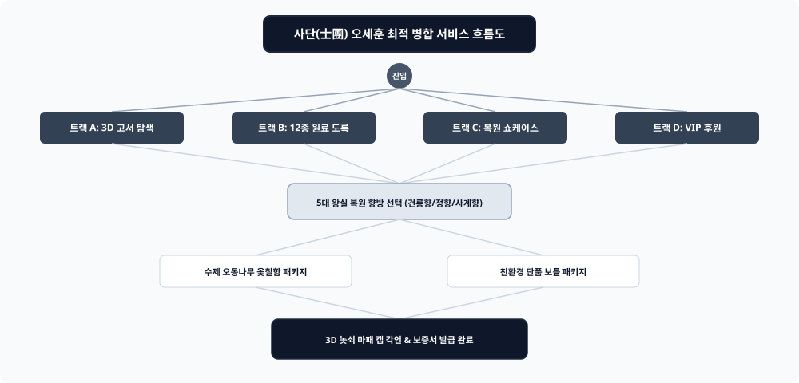

# 📌 [서비스 흐름도 최적 병합] 오세훈 (조선 왕실 의궤 조향 복원 연구원)

---

## 1. 4대 진입 트랙 (Entry Tracks)
1. **Track A (학술 원전 탐색 트랙):** 규장각 의궤 3D 고서 뷰어 ➔ 한자/한글 대조 ➔ 복원 향방 상세
2. **Track B (원료 산지 탐색 트랙):** 조선 팔도 지도 ➔ 12종 한방 원료 산지 ➔ 비건 쌀 주정 확인
3. **Track C (마스터 쇼케이스 트랙):** 오동나무 옻칠함 ➔ 놋쇠 마패 캡 각인 ➔ 본품 구매
4. **Track D (VIP 후원 & 레지스트리 트랙):** 복원 프로젝트 후원 ➔ 고유 시리얼 넘버 발급 ➔ 평생 혜택

---

## 2. 5대 조건부 판단 분기 ({?})
* **Branch 1 {원전 뷰어 모드?}:** [3D 양면 고서 플립] vs [텍스트 원문 대조록]
* **Branch 2 {복원 향방 선택?}:** [건룡향 (제례)] vs [정향 (어향)] vs [사계향 (비전향)]
* **Branch 3 {패키징 형태?}:** [수제 오동나무 옻칠함] vs [친환경 단품 박스]
* **Branch 4 {각인 서비스?}:** [영문/한글 레이저 각인 신청] vs [기본 마패 무각인]
* **Branch 5 {VIP 인증서 수령?}:** [국가기록원 시리얼 등록] vs [일반 구매 완료]

---

## 3. 4대 예외 및 실패 복구 루프 (Fallback Loops)
* **Loop 1 (고서 렌더링 지연 시):** 2D 고화질 텍스트 뷰어로 즉시 자동 전환
* **Loop 2 (오동나무 함 한정 수량 품절 시):** 2차 제작 사전 예약 대기 등록 + 15ml 미니어처 선배송
* **Loop 3 (각인 글자 수 초과 시):** 16자 제한 실시간 경고 및 추천 문구 템플릿 제공
* **Loop 4 (결제 실패/취소 시):** 장바구니 복원 포뮬러 72시간 안전 보관 링크 카카오톡 발송

---

## 4. 사후 리텐션 & 바우처 환급 루프
* 디스커버리 킷 구매 고객에게 본품 구매 시 100% 금액 차감 바우처 즉시 지급.
