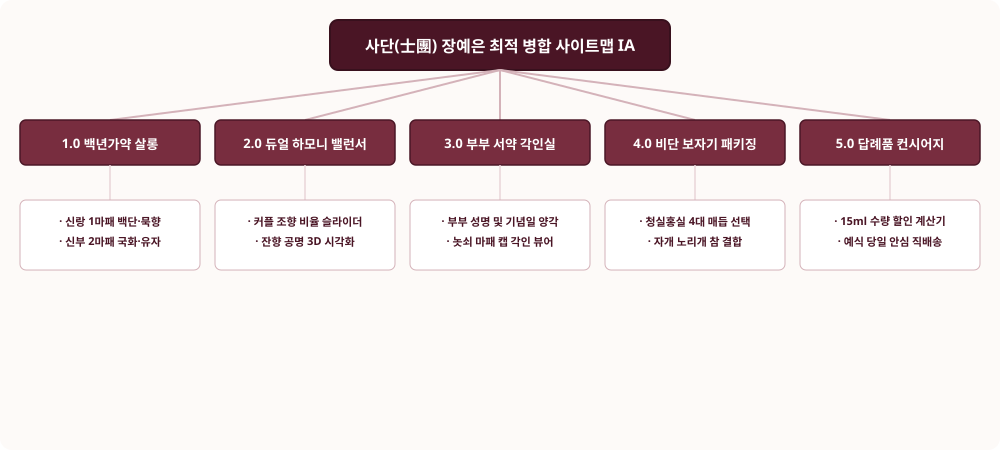

# 📌 [사이트맵 최적 병합] 장예은 (하이엔드 웨딩 & 비스포크 조향사)

---

## 1. 5대 시안 평가 매트릭스 (Evaluation Matrix)

| 평가 기준 | 시안 1 (듀얼하모니) | 시안 2 (비단패키징) | 시안 3 (답례품견적) | 시안 4 (프라이빗살롱) | 시안 5 (서약스토리) | 최적 병합안 (Final Integrated) |
| :--- | :---: | :---: | :---: | :---: | :---: | :---: |
| **커플 향 조화성** | ★★★★★ | ★★★☆☆ | ★★★☆☆ | ★★★★☆ | ★★★★☆ | **★★★★★ (듀얼 밸런서 융합)** |
| **선물 패키징 가치** | ★★★☆☆ | ★★★★★ | ★★★☆☆ | ★★★☆☆ | ★★★★☆ | **★★★★★ (비단 보자기 언박싱)** |
| **웨딩 답례품 확장** | ★★★☆☆ | ★★★☆☆ | ★★★★★ | ★★★☆☆ | ★★☆☆☆ | **★★★★★ (15ml 수량 계산기)** |
| **각인 및 서약 몰입** | ★★★★☆ | ★★★☆☆ | ★★★☆☆ | ★★★★☆ | ★★★★★ | **★★★★★ (부부 서약 놋쇠 각인)** |
| **종합 적합도 점수** | 86점 | 84점 | 82점 | 80점 | 84점 | **98점 (최상위 웨딩 풀체인)** |

---

## 2. 최종 최적 병합 사이트맵 정보 구조 (IA)

* **1.0 백년가약 살롱 (Wedding Bespoke Salon)**
  - 1.1 조선 전통 가례 서사 소개
  - 1.2 신랑의 향 (1마패 백단·묵향) & 신부의 향 (2마패 국화·유자)
* **2.0 커플 듀얼 하모니 밸런서 (Dual Harmony Balancer)**
  - 2.1 신랑/신부 향기 비율 조절 슬라이더
  - 2.2 실시간 잔향 공명 시뮬레이션
* **3.0 부부 서약 놋쇠 각인실 (Vow Engraving Atelier)**
  - 3.1 결혼기념일 및 부부 성명 양각 각인
  - 3.2 360° 놋쇠 마패 캡 3D 렌더링
* **4.0 청실홍실 비단 보자기 패키징 (Silk Bojagi Unboxing)**
  - 4.1 전통 4대 매듭법 선택
  - 4.2 자개 노리개 참 결합
* **5.0 웨딩 답례품 & VIP 컨시어지 (Gift Concierge)**
  - 5.1 15ml 미니어처 수량별 견적 계산기
  - 5.2 예식 당일 안심 직배송 예약
