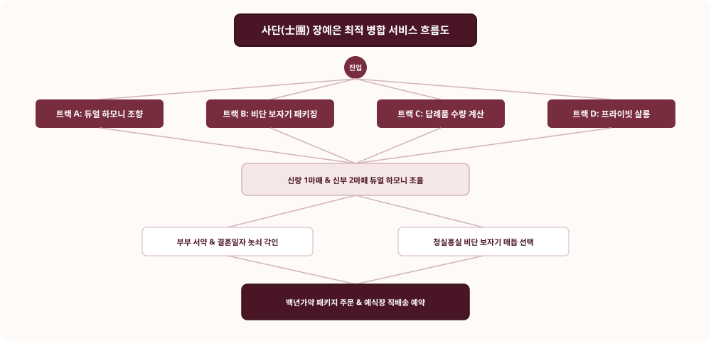

# 📌 [서비스 흐름도 최적 병합] 장예은 (하이엔드 웨딩 & 비스포크 조향사)

---

## 1. 4대 진입 트랙 (Entry Tracks)
1. **Track A (커플 듀얼 비스포크 트랙):** 듀얼 하모니 밸런서 ➔ 신랑/신부 조향 ➔ 부부 서약 각인
2. **Track B (청실홍실 비단 패키징 트랙):** 전통 매듭 4종 ➔ 자개 노리개 참 ➔ 백년가약 2종 세트
3. **Track C (웨딩 답례품 대량 트랙):** 수량 계산기 (50/100/200개) ➔ 감사 태그 ➔ 예식장 직배송
4. **Track D (VIP 프라이빗 살롱 트랙):** 1:1 조향 아틀리에 예약 ➔ 커스텀 블렌딩 ➔ 프리미엄 수령

---

## 2. 5대 조건부 판단 분기 ({?})
* **Branch 1 {구매 목적?}:** [부부 본품 세트] vs [웨딩 하객 답례품] vs [양가 예단 선물]
* **Branch 2 {신랑/신부 향기 밸런스?}:** [동양 우디 강화] vs [플로럴 시트러스 강화]
* **Branch 3 {비단 보자기 매듭 스타일?}:** [청홍 나비매듭] vs [궁중 연꽃매듭]
* **Branch 4 {각인 옵션?}:** [부부 성명 + 결혼일자 양각] vs [미각인]
* **Branch 5 {배송 방식?}:** [예식 당일 식장 직배송] vs [자택 일반 특급 배송]

---

## 3. 4대 예외 및 실패 복구 루프 (Fallback Loops)
* **Loop 1 (답례품 수량 변경 시):** 할인율 즉시 자동 재계산 및 15ml 추가 증정 혜택 갱신
* **Loop 2 (예식 일정 변경 시):** 배송 캘린더에서 클릭 한 번으로 배송일 100% 무료 변경
* **Loop 3 (각인 문구 오타 검수):** 카카오톡으로 최종 각인 시안 이미지 발송 후 1시간 내 수정 기회 제공
* **Loop 4 (비단 보자기 품절 시):** 고급 궁중 자수 한지 박스 무상 업그레이드 옵션 제안
