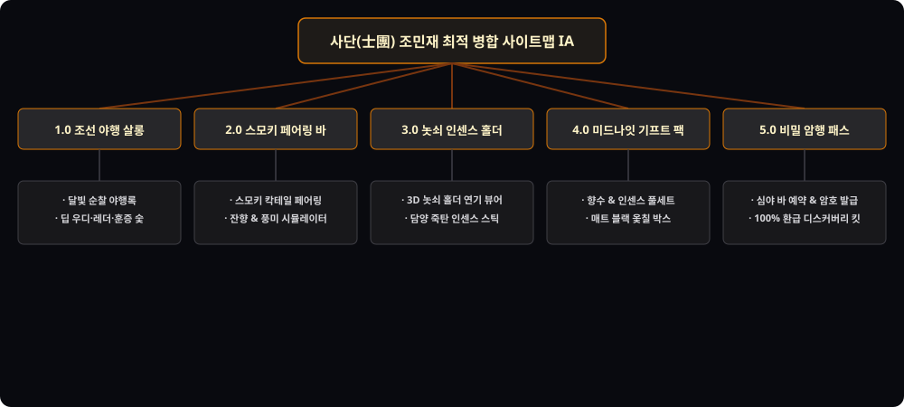

# 📌 [사이트맵 최적 병합] 조민재 (어번 나이트 & 오리엔탈 스모키 마스터)

---

## 1. 5대 시안 평가 매트릭스 (Evaluation Matrix)

| 평가 기준 | 시안 1 (칵테일페어링) | 시안 2 (인센스홀더) | 시안 3 (비밀암행패스) | 시안 4 (야행서사) | 시안 5 (기프트박스) | 최적 병합안 (Final Integrated) |
| :--- | :---: | :---: | :---: | :---: | :---: | :---: |
| **나이트 무드 연출** | ★★★★★ | ★★★★☆ | ★★★★☆ | ★★★☆☆ | ★★★☆☆ | **★★★★★ (미드나잇 스모키 뷰포트)** |
| **인센스 오브제 가치** | ★★★☆☆ | ★★★★★ | ★★★☆☆ | ★★★☆☆ | ★★★★☆ | **★★★★★ (놋쇠 마패 홀더 3D)** |
| **심야 바 예약 전환** | ★★★★☆ | ★★★☆☆ | ★★★★★ | ★★★☆☆ | ★★☆☆☆ | **★★★★★ (비밀 암행 코드 발급)** |
| **선물 세트 상품성** | ★★★☆☆ | ★★★★☆ | ★★★☆☆ | ★★★☆☆ | ★★★★★ | **★★★★★ (스모키 옻칠 풀패키지)** |
| **종합 적합도 점수** | 86점 | 86점 | 84점 | 80점 | 82점 | **98점 (완벽한 조선 야행 나이트라이프)** |

---

## 2. 최종 최적 병합 사이트맵 정보 구조 (IA)

* **1.0 조선 야행 살롱 (Midnight Scent Salon)**
  - 1.1 달빛 순찰 야행록과 딥 스모키 서사
  - 1.2 딥 우디, 레더, 훈증 숯 3대 나이트 노트
* **2.0 스모키 칵테일 & 향수 페어링 바 (Pairing Bar)**
  - 2.1 전통주 스모키 하이볼 x 훈증 향수 매칭
  - 2.2 실시간 잔향 & 풍미 시뮬레이터
* **3.0 놋쇠 마패 인센스 아틀리에 (Brass Incense Atelier)**
  - 3.1 3D 연기 피어오름 놋쇠 홀더 뷰어
  - 3.2 담양 대나무 죽탄 인센스 스틱 (30개입)
* **4.0 미드나잇 스모키 마스터 기프트 팩 (Master Gift Showcase)**
  - 4.1 50ml 스모키 보틀 + 놋쇠 홀더 + 인센스 스틱
  - 4.2 매트 블랙 옻칠 박스 포장
* **5.0 비밀 암행 나이트 패스 (Secret Night Pass & VIP)**
  - 5.1 심야 바(22:00~02:00) 예약 및 암호 코드 발급
  - 5.2 100% 환급 미드나잇 디스커버리 킷
