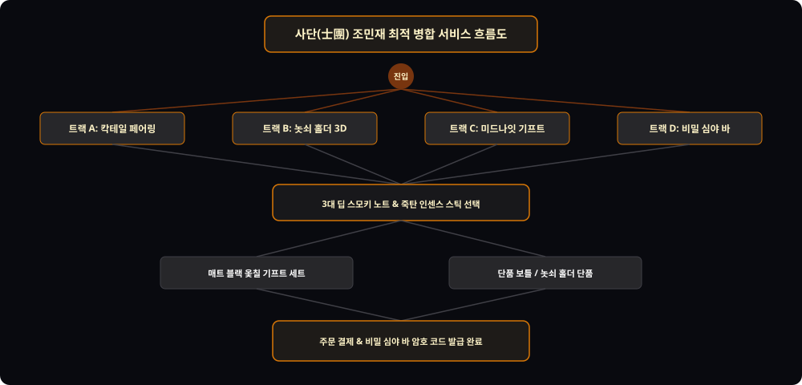

# 📌 [서비스 흐름도 최적 병합] 조민재 (어번 나이트 & 오리엔탈 스모키 마스터)

---

## 1. 4대 진입 트랙 (Entry Tracks)
1. **Track A (스모키 칵테일 페어링 트랙):** 전통주 칵테일 매칭 ➔ 잔향 시뮬레이션 ➔ 스모키 향수
2. **Track B (놋쇠 인센스 홀더 트랙):** 3D 연기 뷰어 ➔ 담양 죽탄 인센스 스틱 ➔ 홀더 세트
3. **Track C (미드나잇 옻칠 기프트 트랙):** 향수 + 인센스 + 트레이 풀세트 ➔ 프리미엄 선물 포장
4. **Track D (비밀 심야 바 암행 트랙):** 심야 세션(22시~02시) 예약 ➔ 비밀 암호 코드 발급

---

## 2. 5대 조건부 판단 분기 ({?})
* **Branch 1 {주요 관심 상품?}:** [스모키 향수 50ml] vs [놋쇠 인센스 홀더] vs [심야 바 예약]
* **Branch 2 {스모키 강도 레벨?}:** [Lv.1 부드러운 차(茶) 훈향] vs [Lv.2 딥 우디 레더] vs [Lv.3 하드 훈증 숯]
* **Branch 3 {인센스 스틱 향 선택?}:** [담양 대나무 죽탄] vs [오대산 백단 훈향]
* **Branch 4 {패키징 형태?}:** [매트 블랙 옻칠 박스] vs [친환경 다크 페이퍼 박스]
* **Branch 5 {VIP 암행 패스 포함 여부?}:** [심야 바 웰컴 드링크 쿠폰 동봉] vs [일반 구매]

---

## 3. 4대 예외 및 실패 복구 루프 (Fallback Loops)
* **Loop 1 (심야 바 세션 만석 시):** 취소표 알림 신청 및 온라인 홈 페어링 키트 할인 쿠폰 지급
* **Loop 2 (인센스 연기 렌더링 지연):** 2D 고화질 정적 이미지 및 아로마 노트 표로 자동 전환
* **Loop 3 (암호 코드 분실 시):** 카카오톡 알림톡으로 1초 재발송 및 모바일 QR 코드 확인 지원
* **Loop 4 (배송 중 인센스 파손 대비):** 완충재 3중 포장 및 파손 시 무조건 100% 당일 맞교환
