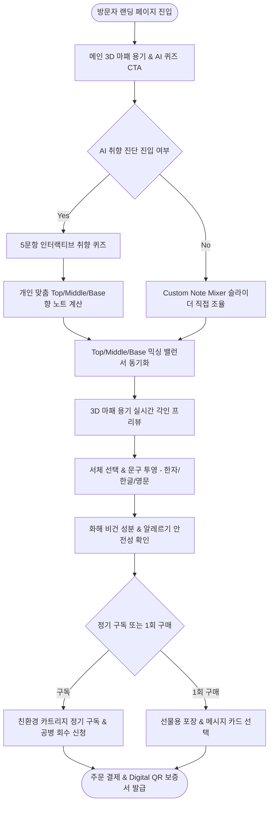

# [사단(士團)] 최하은 클라이언트 서비스 흐름도 병합 분석 보고서 (5개 시안 최적 병합)

---

## 1. 5개 서비스 흐름 시안 기획 및 최적 병합 개요

본 보고서는 최하은 PM의 핵심 비즈니스 모델인 **AI 취향 진단**과 **3D 실시간 마패 용기 각인**, **향 노트 믹싱**을 종합하여 5개 시안(Ver 1 ~ Ver 5) 중 가장 전환율이 높고 이탈 위험이 적은 하이브리드 유저 플로우(User Flow)를 도출한 최종 병합 보고서입니다.

### 5개 시안 유저플로우 비교표
| 구분 | 중심 시나리오 | 이탈 위험 구간 | 전환 유도 장치 | 병합 채택 결론 |
| :--- | :--- | :--- | :--- | :--- |
| **Ver 1** | AI 5문항 퀴즈 직진 추천 | 퀴즈 문항 이탈 | 퀴즈 완료 시 AI 보증서 발급 | **[주요 동선 A]** 초보 쇼퍼용 AI 진단 모달 엔트리 채택 |
| **Ver 2** | 3D 용기 각인 스튜디오 선행 | 3D 캔버스 로딩 딜레이 | 훈민정음 사자성어 추천 뱃지 | **[주요 동선 B]** 360도 실시간 마패 용기 렌더링 채택 |
| **Ver 3** | Top/Middle/Base 믹서 직접 조율 | 조향 비율 설정 난해함 | AI 추천 비율 1-Click 자동 세팅 | **[핵심 조향]** T/M/B 슬라이더 & 성상 피라미드 채택 |
| **Ver 4** | 친환경 카트리지 구독 & 공병 | 결제 단계 정기 구독 부담 | 공병 반납 리워드 포인트 즉시 할인가 적용 | **[옵션 1]** 결제 단계 친환경 정기 구독 옵션 채택 |
| **Ver 5** | 기프트 각인 & 수령인 초청 | 선물 수령인 주소 미입력 | 카카오톡 AI 퀴즈 수령인 초청 링크 | **[옵션 2]** 메시지 카드 & 고급 비단 보자기 패키징 채택 |

---

## 2. 세부 통합 유저 플로우 & 입출력 데이터 명세

---

## 3. 단계별 UX 전환 조건 및 예외 처리(Exception Handling)

| 단계 | 전환 조건 (Triggers) | 입력 데이터 (Input) | 출력 데이터 (Output) | 예외 처리 및 이탈 방지 |
| :---: | :--- | :--- | :--- | :--- |
| **1. 진입** | 메인 랜딩 버튼 클릭 | 접속 디바이스 스펙 | 3D 용기 캔버스 / AI 퀴즈 CTA | WebGL 미지원 시 2D 회색 마패 이미지 대체 |
| **2. AI 퀴즈** | 5문항 선택 완료 | 퀴즈 Answer Array [1..5] | 맞춤 향 노트 비율 계산 | 중간 이탈 시 임의 인기 향 레시피 자동 적용 |
| **3. 노트 믹싱** | 슬라이더 드래그 조율 | T/M/B 비율 % 값 (합 100%) | 향 성상 피라미드 시각화 | 합계 100% 미달 시 Base 노트 자동 자동보정 |
| **4. 3D 각인** | 서체 및 문구 입력 | 각인 텍스트 (최대 10자) | 3D 마패 용기 실시간 투영 | 영문/특수문자 입력 시 한글/한자 권장 토스트 메시지 |
| **5. 결제/완료** | 결제 수단 승인 | 배송지 / 구독 카드 등록 | 주문번호 및 Digital QR 보증서 | 주문 즉시 공병 회수용 바코드 문자가 자동 발송됨 |
