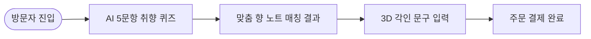

# 📌 [서비스 흐름도 시안 1] 최하은 클라이언트 - AI 퀴즈 매칭 직진 플로우

## 1. 시안 개요 및 서비스 시나리오
- **시나리오 컨셉:** 사용자 취향 진단을 시작으로 맞춤형 추천 향수를 빠르게 구매까지 유도하는 **AI Quick Recommendation Flow**.
- **주요 대상:** 향수 취향 선택에 어려움을 느끼는 신규 쇼퍼.

---

## 2. 세부 단계별 사용자 행동 & 시스템 반응 명세

| 단계 | 사용자 행동 | 시스템 반응 & UX 로직 | 입출력 데이터 |
| :---: | :--- | :--- | :--- |
| **Step 1** | 메인 랜딩 페이지 진입 | AI 취향 진단 퀴즈 인터랙티브 모달 팝업 | 입력: 접속 디바이스 / 출력: 퀴즈 시작 CTA |
| **Step 2** | 라이프스타일 5문항 답변 선택 | 실시간 선택지 인터랙션 및 프로그레스 바 상승 | 입력: 퀴즈 Answer 1~5 / 출력: 추천 향 조합 계산 |
| **Step 3** | 진단 결과 매칭 향 확인 | 개인 맞춤 마패 향 피라미드 시각화 출력 | 입력: 진단 완료 / 출력: Top/Middle/Base 비율 추천값 |
| **Step 4** | 3D 용기 각인 문구 입력 | 3D 마패 용기 표면에 서체 실시간 투영 | 입력: 한자/한글 텍스트 / 출력: 3D Canvas Renders |
| **Step 5** | 주문 및 결제 완료 | 주문 데이터 수집 및 공병 카트리지 자동 세팅 | 입력: 결제 정보 / 출력: AI 레시피 스마트 보증서 |

---

## 3. 시안 1 유저플로우 다이어그램 (Mermaid)

---

## 4. 장단점 및 병합 시 참고 포인트
- **장점:** 이탈 지점이 최소화되어 AI 진단에서 구매까지 신속하게 연결됨.
- **단점:** 사용자가 노트 비율을 직접 미세 조정하고 싶을 경우 조향 자유도가 낮게 느껴질 수 있음.
