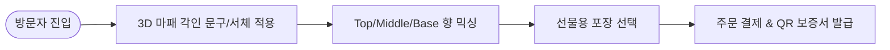

# 📌 [서비스 흐름도 시안 2] 최하은 클라이언트 - 3D 각인 스튜디오 체험 선행 플로우

## 1. 시안 개요 및 서비스 시나리오
- **시나리오 컨셉:** 3D 용기 각인과 문구 조합 체험을 서비스 시점 최전면에 내세우는 **Visual Engraving First Flow**.
- **주요 대상:** 나만의 문구가 각인된 개성 있는 선물이나 기념품을 만들고자 하는 고객.

---

## 2. 세부 단계별 사용자 행동 & 시스템 반응 명세

| 단계 | 사용자 행동 | 시스템 반응 & UX 로직 | 입출력 데이터 |
| :---: | :--- | :--- | :--- |
| **Step 1** | 메인 랜딩 3D 캔버스 터치 | 3D 마패 용기 360도 인터랙티브 드래그 회전 | 입력: 마우스/터치 드래그 / 출력: 3D 뷰포트 전환 |
| **Step 2** | 서체 및 각인 문구 입력 | 훈민정음 한자/서예 한글/영문 폰트 선택 및 투영 | 입력: 각인 텍스트 / 출력: 3D 실시간 텍스트 렌더링 |
| **Step 3** | 향 노트 믹싱 슬라이더 조정 | Top/Middle/Base 비율 믹싱 및 향 성상 시각화 | 입력: Slider % 값 / 출력: 향 피라미드 그래픽 |
| **Step 4** | 선물용 포장 및 옵션 선택 | 보자기 패키징 및 메시지 카드 팝업 모달 | 입력: 포장 옵션 / 출력: 카트리지 요약 정보 |
| **Step 5** | 결제 및 QR 각인 확인서 발급 | 결제 처리 및 3D 각인 시뮬레이션 QR 보증서 생성 | 입력: 결제 정보 / 출력: QR 디지털 보증서 |

---

## 3. 시안 2 유저플로우 다이어그램 (Mermaid)

---

## 4. 장단점 및 병합 시 참고 포인트
- **장점:** 시각적 재미와 각인 몰입도가 매우 뛰어남.
- **단점:** 각인 텍스트를 고르느라 탐색 시간이 길어질 수 있으므로 추천 각인 문구(예: 훈민정음 사자성어) 가이드 탑재 필요.
