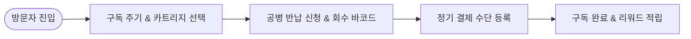

# 📌 [서비스 흐름도 시안 4] 최하은 클라이언트 - 친환경 정기 구독 & 공병 회수 신청 플로우

## 1. 시안 개요 및 서비스 시나리오
- **시나리오 컨셉:** 친환경 카트리지 구독과 공병 반납 포인트를 유도하는 **Eco Subscription & Recycling Flow**.
- **주요 대상:** 지속 가능한 친환경 소비를 중시하는 쇼퍼, 재구매 구독 고객.

---

## 2. 세부 단계별 사용자 행동 & 시스템 반응 명세

| 단계 | 사용자 행동 | 시스템 반응 & UX 로직 | 입출력 데이터 |
| :---: | :--- | :--- | :--- |
| **Step 1** | Eco Refill 메인 진입 | 친환경 구독 주기(1/2/3개월) 및 공병 반납 리워드 안내 | 입력: 접속 / 출력: 구독 헤네핏 가이드 |
| **Step 2** | 카트리지 향 및 용기 선택 | 3D 각인 용기 + 리필 카트리지 콤보 패키지 지정 | 입력: 향 및 용기 선택 / 출력: 패키지 가감액 시각화 |
| **Step 3** | 공병 회수 신청 & 주소 입력 | 택배 자동 방문 수거 신청 및 리워드 포인트 사전 적립 | 입력: 회수 주소 / 출력: 공병 회수 바코드 발급 |
| **Step 4** | 카트리지 자동 결제 동의 | 정기 구독 결제 수단 등록 및 첫 회 각인 문구 확인 | 입력: 카드 등록 / 출력: 정기 구독 스케줄표 |
| **Step 5** | 구독 주문 완료 | 친환경 패키징 출하 안내 및 리워드 포인트 적립 | 입력: 결제 완료 / 출력: 구독 관리 대시보드 |

---

## 3. 시안 4 유저플로우 다이어그램 (Mermaid)

---

## 4. 장단점 및 병합 시 참고 포인트
- **장점:** 정기 구매 전환율이 높고 공병 반납을 통한 에코 브랜드 신뢰도 구축.
- **단점:** 커스텀 3D 각인과 조향 믹싱의 즐거움이 가려질 수 있으므로 커스텀 용기 선택을 첫 단구에 연동할 필요 있음.
