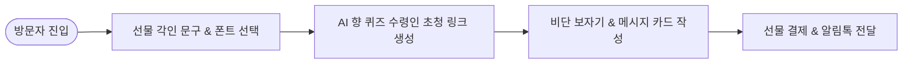

# 📌 [서비스 흐름도 시안 5] 최하은 클라이언트 - 선물하기 메시지 패키징 특화 플로우

## 1. 시안 개요 및 서비스 시나리오
- **시나리오 컨셉:** 한자/서체 각인 선물과 메시지 카드를 전하는 **Special Gift & Engraving Flow**.
- **주요 대상:** 기념일, 생일, 감사 선물을 커스텀 향수로 준비하는 선물 구매 쇼퍼.

---

## 2. 세부 단계별 사용자 행동 & 시스템 반응 명세

| 단계 | 사용자 행동 | 시스템 반응 & UX 로직 | 입출력 데이터 |
| :---: | :--- | :--- | :--- |
| **Step 1** | Engraving Gift 갤러리 클릭 | 인기 각인 문구 룩북 및 보자기 패키징 비주얼 노출 | 입력: 갤러리 접속 / 출력: 선물 룩북 갤러리 |
| **Step 2** | 받는 사람 전용 각인 문구 작성 | 3D 마패 용기 표면에 선물 받는 사람 성함/사자성어 투영 | 입력: 받는 사람 문구 / 출력: 3D 실시간 각인 프리뷰 |
| **Step 3** | AI 향 퀴즈 초청 링크 생성 (선택) | 받으실 분이 직접 향을 고를 수 있는 AI 퀴즈 모바일 카카오 링크 발급 | 입력: 퀴즈 링크 발급 / 출력: 카카오 초청 링크 |
| **Step 4** | 메시지 카드 작성 & 포장 선택 | 고급 비단 보자기 및 놋쇠 엽서 메시지 작성 | 입력: 카드 메세지 / 출력: 패키징 최종 시안 |
| **Step 5** | 선물 결제 & 배송지 등록 | 선물 주문 처리 및 선물 수령인 배송지 입력 폼 생성 | 입력: 결제 & 배송 정보 / 출력: 선물 전달 카카오 알림톡 |

---

## 3. 시안 5 유저플로우 다이어그램 (Mermaid)

---

## 4. 장단점 및 병합 시 참고 포인트
- **장점:** 객단가가 높고 선물 수령인이 AI 퀴즈를 받아 직접 향을 고를 수 있어 혁신적임.
- **단점:** 본인 사용 구매 고객에게는 절차가 복잡할 수 있어 일반 구매 동선 탭 제공 필요.
