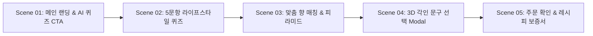

# 📌 [스토리보드 시안 1] 최하은 클라이언트 - AI 취향 진단 스마트 퀴즈 중심 스토리보드 (Ver 1)

## 1. 스토리보드 기본 정보
- **클라이언트명:** 최하은 (사단 AI 조향 LAB & 3D 각인 PM)
- **컨셉 명칭:** **AI Quick Recommendation Storyboard (Wizard Card Layout)**
- **주요 목적:** 초보 조향 사용자가 5단계 AI 라이프스타일 퀴즈를 통해 최적의 향 노트를 추천받고, 마패 용기 각인까지 직진하도록 유도하는 스토리보드.
- **레이아웃 타입:** **Type B (단계별 위저드 가이드 레이아웃)**

---

## 2. 화면 단위 스토리보드 시퀀스 명세



---

### 🎬 Scene 01: 메인 랜딩 & AI 취향 진단 퀴즈 엔트리 Hero

#### [화면 레이아웃 구조 (ASCII Wireframe)]
```text
+-----------------------------------------------------------------------------------+
| [Header] 로고(士團) | GNB (AI Finder / 3D Engrave / Mixer / Eco) | Cart (0)        |
+-----------------------------------------------------------------------------------+
| [Hero Banner - 60% Viewport]                                                      |
|  "나의 숨겨진 향 정체성을 찾아서"                                                 |
|  조선 어사 첩보 비밀 레시피 기반 AI 5문항 취향 진단                               |
|                                                                                   |
|  [ AI 3초 취향 진단 시작하기 (Primary Button) ]                                   |
+-----------------------------------------------------------------------------------+
| [Bottom Cards - 40%]                                                              |
|  [인기 추천 향 1]           | [인기 추천 향 2]           | [인기 추천 향 3]       |
+-----------------------------------------------------------------------------------+
```

#### [화면 명세 & UI 컴포넌트 데이터]
- **화면 목적:** 접속자에게 AI 퀴즈 참가를 즉각 유도하여 이탈률을 낮춤.
- **주요 컴포넌트:**
  - `Hero Banner`: 텍스트 타이틀, 어사 마패 비주얼 배경 플레이스홀더.
  - `AI Start CTA`: 클릭 시 Scene 02 인터랙티브 퀴즈 모달이 중앙 오버레이 팝업됨.
  - `Recommended Cards`: 베스트셀러 커스텀 조합 3종 미리보기 카드.
- **화면 문구 (Copywriting):** "조선 암행어사 비밀 레시피가 AI 알고리즘으로 탄생하다. 당신만의 시그니처 향을 진단해보세요."

---

### 🎬 Scene 02: 5문항 라이프스타일 퀴즈 진행 Card

#### [화면 레이아웃 구조 (ASCII Wireframe)]
```text
+-----------------------------------------------------------------------------------+
| [Quiz Modal Overlay (Center)]                                                     |
|  [Step Indicator Bar: ======> Progress 40% (2/5) ]                                |
|                                                                                   |
|  Q2. 주말 아침, 당신이 가장 몰입하고 싶은 순간의 분위기는?                       |
|                                                                                   |
|  [ Option A: 차분한 고택 마루의 맑은 바람 (우디/그린) ]                          |
|  [ Option B: 햇살을 머금은 새벽 꽃밭의 온기 (플로럴/시트러스) ]                   |
|  [ Option C: 깊은 밤 먹향이 감도는 서재의 고요 (머스크/앰버) ]                   |
|  [ Option D: 이슬 젖은 숲길의 시원한 감촉 (아쿠아/모스) ]                        |
|                                                                                   |
|  [ 이전 문항 ]                                                  [ 다음 문항 ]     |
+-----------------------------------------------------------------------------------+
```

#### [화면 명세 & UI 컴포넌트 데이터]
- **화면 목적:** 5가지 질문에 답하며 사용자의 라이프스타일 취향 데이터 수집.
- **주요 컴포넌트:**
  - `Progress Bar`: 퀴즈 진행률(20% -> 40% -> 60% -> 80% -> 100%) 시각화.
  - `Option Cards (A~D)`: 선택 시 호버 액션 및 체크표시 활성화, 클릭 시 자동 다음 문항 이동.
  - `Navigation Buttons`: [이전] / [다음] 문항 이동 제어.
- **데이터 처리:** 사용자의 선택 값을 배열 `[Ans1, Ans2, Ans3, Ans4, Ans5]` 형태로 메모리에 저장.

---

### 🎬 Scene 03: 맞춤 향 매칭 결과 & 피라미드 Visual

#### [화면 레이아웃 구조 (ASCII Wireframe)]
```text
+-----------------------------------------------------------------------------------+
| [Result Screen]                                                                   |
|  "당신을 위한 마패 레시피: [어사 비밀 첩보 № 07 - 청운(靑雲)]"                     |
|                                                                                   |
| +------------------------------------+------------------------------------------+ |
| | [Left: 향 피라미드 시각화 모듈]   | [Right: 추천 노트 세부 명세]             | |
| |  ▲ Top: 맑은 사과 & 시트러스 (25%)  | - Top Note: 맑은 사과, 베르가못          | |
| |  ■ Mid: 서예 묵향 & 연꽃 (45%)      | - Middle Note: 조선 먹향, 련(蓮)         | |
| |  ▼ Base: 놋쇠 앰버 & 모스 (30%)     | - Base Note: 놋쇠 앰버, 청송 모스        | |
| +------------------------------------+------------------------------------------+ |
|                                                                                   |
|  [ 이 향으로 믹싱 밸런서 확정하기 ]       [ 3D 마패 용기 각인으로 넘어가기 (Primary)]|
+-----------------------------------------------------------------------------------+
```

#### [화면 명세 & UI 컴포넌트 데이터]
- **화면 목적:** AI 진단 결과를 visual 그래프와 성분표로 명확하게 제시하여 구매 유도.
- **주요 컴포넌트:**
  - `Recipe Title Badge`: AI 추천 레시피 고유 명칭 출력.
  - `Note Pyramid Visual`: Top/Middle/Base 비율을 3단 삼각 형태 그래프로 시각화.
  - `Action Buttons`: [믹싱 조율] 클릭 시 노트 믹서 이동 / [3D 각인] 클릭 시 Scene 04 연동.

---

### 🎬 Scene 04: 3D 마패 각인 문구 선택 Modal

#### [화면 레이아웃 구조 (ASCII Wireframe)]
```text
+-----------------------------------------------------------------------------------+
| [Engraving Modal]                                                                 |
| +--------------------------------------+----------------------------------------+ |
| | [3D Vessel Preview - Gray Canvas]    | [Engraving Control Panel]              | |
| |                                      |  서체 선택:                             | |
| |        ( 3D 마패 용기 렌더링 )        |  (o) 훈민정음 한자  ( ) 서예 한글       | |
| |        "靑雲 (청운)" 각인 투영       |                                        | |
| |                                      |  각인 문구 입력:                       | |
| |                                      |  [ 靑雲                            ]   | |
| +--------------------------------------+----------------------------------------+ |
|                                                                                   |
|  [ 각인 캡처 저장 ]                             [ 이 각인으로 장바구니 담기 (CTA) ]|
+-----------------------------------------------------------------------------------+
```

#### [화면 명세 & UI 컴포넌트 데이터]
- **화면 목적:** 용기 표면에 나만의 문구를 투영시켜 개별화된 소유감을 완성함.
- **주요 컴포넌트:**
  - `3D Gray Canvas`: 마패 용기 회색 UI 뷰포트, 문구 텍스처 실시간 투영.
  - `Font Radio Picker`: 훈민정음 한자 / 서예 한글 서체 선택 스위치.
  - `Text Input Field`: 각인 텍스트 입력 폼 (최대 10자 제한).

---

### 🎬 Scene 05: 주문 확인 & 레시피 보증서 발급

#### [화면 레이아웃 구조 (ASCII Wireframe)]
```text
+-----------------------------------------------------------------------------------+
| [Checkout & Certificate Screen]                                                   |
|  "나만의 커스텀 향수 주문이 정상 완료되었습니다."                                 |
|                                                                                   |
| +-------------------------------------------------------------------------------+ |
| | [Digital Recipe Certificate Card]                                             | |
| |  - 레시피 번호: SD-2026-AI07-0042                                             | |
| |  - 각인 문구: 靑雲 (청운)                                                     | |
| |  - 향 조합: Top 25% | Mid 45% | Base 30%                                      | |
| |  - [ Digital QR 보증서 바코드 이미지 ]                                        | |
| +-------------------------------------------------------------------------------+ |
|                                                                                   |
|  [ 친환경 리필 카트리지 정기 구독 신청 ]               [ 메인으로 돌아가기 ]      |
+-----------------------------------------------------------------------------------+
```

#### [화면 명세 & UI 컴포넌트 데이터]
- **화면 목적:** 최종 구매 완료 안내 및 디지털 레시피 보증서 QR 발급.
- **주요 컴포넌트:**
  - `Certificate Card`: 레시피 넘버, 각인 문구, 믹싱 비율이 기재된 디지털 보증서.
  - `QR Code Generator`: 스마트폰에 보관할 수 있는 QR 이미지.
  - `Refill Sub Banner`: 리필 카트리지 구독 유도 하단 바.
