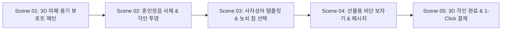

# 📌 [스토리보드 시안 2] 최하은 클라이언트 - 3D 각인 캔버스 중심 스토리보드 (Ver 2)

## 1. 스토리보드 기본 정보
- **클라이언트명:** 최하은 (사단 AI 조향 LAB & 3D 각인 PM)
- **컨셉 명칭:** **Interactive 3D Engraving Studio Storyboard (Dual Split Canvas Layout)**
- **주요 목적:** 360도 회전 회색 3D 용기 캔버스에서 훈민정음 한자 및 서예 한글 각인 문구를 실시간 확인하며 선물용 포장까지 선택하는 체험형 스토리보드.
- **레이아웃 타입:** **Type C (분할 스크롤 듀얼 레이아웃)**

---

## 2. 화면 단위 스토리보드 시퀀스 명세



---

### 🎬 Scene 01: 3D 마패 용기 회색 UI 뷰포트 & 서체 선택 메인

#### [화면 레이아웃 구조 (ASCII Wireframe)]
```text
+-----------------------------------------------------------------------------------+
| [Header] 로고(士團) | 3D Engraving Studio | Note Mixer | Eco Sub | Quick Cart     |
+-----------------------------------------------------------------------------------+
| [Left 50%: Fixed 3D Viewport]          | [Right 50%: Engraving Control Panel]     |
| +------------------------------------+ |  "나만의 어사 마패 문구를 각인하세요"    |
| |                                    | |                                          |
| |     [ 3D 회색 UI 마패 용기 ]       | |  1. 서체 선택 (Font Selector):          |
| |     - 360도 드래그 회전 지원       | |     [ (o) 훈민정음 한자 ] [ ( ) 서예한글] |
| |     - 용기 놋쇠 질감 렌더링        | |                                          |
| |                                    | |  2. 각인 문구 입력:                      |
| +------------------------------------+ |     [ 一片丹心 (일편단심)             ]  |
|  [ 3D 줌인/줌아웃 ] [ 2D 대체 뷰어 ]   | |     * 영문/한자/한글 10자 이내          |
+-----------------------------------------------------------------------------------+
| [Bottom Bar] 선택 각인 옵션 적용 현황  | [ 다음: 놋쇠 참 & 향 노트 믹싱 선택 ]    |
+-----------------------------------------------------------------------------------+
```

#### [화면 명세 & UI 컴포넌트 데이터]
- **화면 목적:** 접속과 동시에 3D 마패 용기를 360도 회전시키며 각인 체험에 몰입시킴.
- **주요 컴포넌트:**
  - `Fixed 3D Canvas (Left 50%)`: WebGL 기반 360도 마패 용기회색 UI 뷰포트.
  - `Font Selector`: 훈민정음 한자 / 서예 한글 서체 토글 픽커.
  - `Engraving Input Field`: 실시간 각인 텍스트 입력창.
- **화면 문구 (Copywriting):** "조선 왕실 어사 마패 용기에 훈민정음 서체로 영원히 변치 않을 문구를 3D로 레이저 각인하세요."

---

### 🎬 Scene 02: 훈민정음 한자/서예 한글 폰트 실시간 텍스처 투영

#### [화면 레이아웃 구조 (ASCII Wireframe)]
```text
+-----------------------------------------------------------------------------------+
| [Left 50%: Fixed 3D Viewport]          | [Right 50%: Realtime Font Renders]       |
| +------------------------------------+ |  [서체별 렌더링 스타일 실시간 비교]      |
| |                                    | |                                          |
| |   ( 3D 용기 표면에 "一片丹心" )    | |  - 훈민정음 한자 서체 (선택됨)           | |
| |    음각 레이저 텍스처 실시간 투영  | |    미려하고 위엄 있는 조선 왕실 목판 각인  | |
| |                                    | |                                          |
| |                                    | |  - 서예 한글 붓글씨 서체                 | |
| |                                    | |    유려하고 감성적인 한글 필체            | |
| +------------------------------------+ |                                          |
|  [ 각인 텍스처 줌인 (Zoom 200%) ]      |  [ 추천 사자성어 템플릿 불러오기 ]       |
+-----------------------------------------------------------------------------------+
```

#### [화면 명세 & UI 컴포넌트 데이터]
- **화면 목적:** 입력한 텍스트가 서체에 따라 3D 용기에 표현되는 깊이감을 실시간 비교.
- **주요 컴포넌트:**
  - `Texture Engrave Shader`: 3D 용기 표면에 음각/양각 음영을 투영하는 셰이더.
  - `Zoom 200% Control`: 용기 표면의 미세한 서체 획을 확대해볼 수 있는 버튼.
  - `Font Style Cards`: 각 서체의 특징과 정서적 가치를 설명하는 정보 카운터.

---

### 🎬 Scene 03: 사자성어 각인 템플릿 & 놋쇠 참(Charm) 조합

#### [화면 레이아웃 구조 (ASCII Wireframe)]
```text
+-----------------------------------------------------------------------------------+
| [Left 50%: 3D Viewport with Charm]     | [Right 50%: Gift Template & Charm Selection]|
| +------------------------------------+ |  [추천 각인 사자성어 베스트 4]           |
| |                                    | |  [1. 一片丹心] [2. 靑雲之志]             |
| |  ( 3D 용기 + 놋쇠 참 장식 결합 )   | |  [3. 溫故知新] [4. 永遠不滅]             |
| |   마패 고리에 놋쇠 참 3D 렌더링    | |                                          |
| |                                    | |  [마패 고리 놋쇠 참 굿즈 옵션]           |
| +------------------------------------+ |  (o) 1마패 초급 참  ( ) 3마패 어사 참     |
+-----------------------------------------------------------------------------------+
```

#### [화면 명세 & UI 컴포넌트 데이터]
- **화면 목적:** 어떤 문구를 각인할지 고민하는 사용자에게 훈민정음 사자성어 템플릿과 실물 놋쇠 참(Charm) 장식 옵션 제공.
- **주요 컴포넌트:**
  - `Four-character Idiom Pills`: 클릭 한 번으로 문구가 입력 필드에 자동 배치되는 버튼.
  - `Brass Charm Selector`: 마패 병 고리에 결합되는 놋쇠 참 3D 오브젝트 선택기.

---

### 🎬 Scene 04: 선물용 비단 보자기 및 메시지 엽서 패키징 선택

#### [화면 레이아웃 구조 (ASCII Wireframe)]
```text
+-----------------------------------------------------------------------------------+
| [Left 50%: Gift Packaging 3D Visual]   | [Right 50%: Packaging Option Form]       |
| +------------------------------------+ |  [선물용 전용 패키징 옵션]                |
| |                                    | |                                          |
| |    ( 3D 비단 보자기 포장 세트 )    | |  보자기 색상 선택:                      |
| |     - 전통 청색 보자기 패키징      | |  [ (o) 옥색 비단 ] [ ( ) 붉은 비단 ]     |
| |     - 놋쇠 마패 엽서 메시지        | |                                          |
| +------------------------------------+ |  놋쇠 엽서 메시지 입력 (선물 수령인 용): |
|                                        |  [ 축하의 마음을 담아 보냅니다...      ] |
+-----------------------------------------------------------------------------------+
```

#### [화면 명세 & UI 컴포넌트 데이터]
- **화면 목적:** 선물용 구매 고객을 위해 전통 비단 보자기 포장 및 메시지 엽서 옵션 수립.
- **주요 컴포넌트:**
  - `Bojagi Color Picker`: 옥색 비단 / 붉은 비단 / 먹색 비단 포장 선택 타일.
  - `Brass Postcard Textarea`: 선물 수령인에게 전달할 메시지 작성 폼.

---

### 🎬 Scene 05: 실시간 3D 각인 완료 캡처 & 1-Click 주문 결제

#### [화면 레이아웃 구조 (ASCII Wireframe)]
```text
+-----------------------------------------------------------------------------------+
| [Final Custom Summary Screen]                                                     |
|  "당신이 완성한 3D 마패 용기 각인 커스텀 세트"                                    |
|                                                                                   |
| +-------------------------------------------------------------------------------+ |
| | [Completed 3D Render Image Card]                                              | |
| |  - 각인 문구: 훈민정음 한자 "一片丹心"                                        | |
| |  - 결합 참: 3마패 놋쇠 어사 참 장식                                           | |
| |  - 패키징: 옥색 비단 보자기 포장 + 놋쇠 메시지 엽서                           | |
| |  - 포함 향수: AI 맞춤 믹싱 커스텀 향수 50ml                                   | |
| +-------------------------------------------------------------------------------+ |
|                                                                                   |
|  [ 3D 각인 이미지 저장 (Image Download) ]           [ 1-Click 선물 주문 결제 (CTA) ]|
+-----------------------------------------------------------------------------------+
```

#### [화면 명세 & UI 컴포넌트 데이터]
- **화면 목적:** 완성된 3D 각인 용기 세트의 최종 렌더링 캡처와 주문 완료 처리.
- **주요 컴포넌트:**
  - `Summary Render Card`: 각인 문구, 폰트, 참, 포장, 향 세부 항목 총괄 표시.
  - `Render Image Download Button`: 사용자가 제작한 3D 각인 용기 렌더링 이미지 다운로드 기능.
  - `Gift Order CTA`: 결제 페이지로 이동하는 최우선 CTA 버튼.
