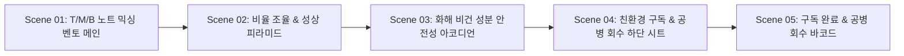

# 📌 [스토리보드 시안 3] 최하은 클라이언트 - 노트 믹싱 & 친환경 구독 연계 스토리보드 (Ver 3)

## 1. 스토리보드 기본 정보
- **클라이언트명:** 최하은 (사단 AI 조향 LAB & 3D 각인 PM)
- **컨셉 명칭:** **Pro Mixer & Eco Subscription Storyboard (Bento Grid + Bottom Sheet Layout)**
- **주요 목적:** Top/Middle/Base 노트 비율을 드래그 슬라이더로 조율하고, 친환경 카트리지 정기 구독과 공병 회수를 간편하게 연동하는 기능 중심 스토리보드.
- **레이아웃 타입:** **Type A (벤토 그리드 모듈) + Type E (하단 시트)**

---

## 2. 화면 단위 스토리보드 시퀀스 명세



---

### 🎬 Scene 01: Top/Middle/Base 3단 믹싱 밸런서 벤토 그리드 메인

#### [화면 레이아웃 구조 (ASCII Wireframe)]
```text
+-----------------------------------------------------------------------------------+
| [Header] 로고(士團) | Custom Note Mixer | Eco Sub | Ingredient | Quick Cart       |
+-----------------------------------------------------------------------------------+
| [Bento Grid Layout - 2x2 Modules]                                                 |
| +------------------------------------+------------------------------------------+ |
| | [Module A: Top Note Slider (%)]    | [Module B: Middle Note Slider (%)]       | |
| |  - 시트러스 / 애플 (현재 30%)      |  - 서예 묵향 / 연꽃 (현재 40%)           | |
| |  [====o------------------]         |  [========o--------------]               | |
| +------------------------------------+------------------------------------------+ |
| | [Module C: Base Note Slider (%)]   | [Module D: 향 성상 피라미드 Visual]      | |
| |  - 놋쇠 앰버 / 머스크 (현재 30%)   |  ▲ Top (30%)                             | |
| |  [====o------------------]         |  ■ Mid (40%)  ▼ Base (30%)               | |
| +------------------------------------+------------------------------------------+ |
+-----------------------------------------------------------------------------------+
| [Aside Bar] 조향 합계 (100%) | [AI 추천 비율 적용] | [성분 확인 및 구독 진행 CTA] |
+-----------------------------------------------------------------------------------+
```

#### [화면 명세 & UI 컴포넌트 데이터]
- **화면 목적:** 4개의 모듈 타일에서 각 향 노트 비율을 직관적으로 조작하게 함.
- **주요 컴포넌트:**
  - `Bento Modules (A~C)`: Top/Middle/Base 노트 비율 드래그 슬라이더.
  - `Bento Module D`: 노트 비율 조율 시 실시간 형태가 변화하는 향 성상 피라미드.
  - `Auto Total Bar`: 3개 비율의 합이 100%가 되도록 자동 보정하는 지표.
- **화면 문구 (Copywriting):** "Top, Middle, Base 노트를 자유롭게 조율하여 나만의 독창적인 향 포뮬러를 완성하세요."

---

### 🎬 Scene 02: 믹싱 비율(%) 조율 및 향 성상 잔향 시각화

#### [화면 레이아웃 구조 (ASCII Wireframe)]
```text
+-----------------------------------------------------------------------------------+
| [Interactive Note Mixing Detail]                                                  |
|  "비율 조정에 따라 잔향 지속 시간과 은은함의 깊이가 변화합니다"                   |
|                                                                                   |
|  Top Note (30%): 첫 30분간 퍼지는 청량하고 맑은 풋사과 향                          |
|  Middle Note (40%): 1~3시간 동안 유지되는 묵직한 조선 먹향과 연꽃 향              |
|  Base Note (30%): 5시간 이상 피부에 은은하게 남는 놋쇠 앰버와 모스크              |
|                                                                                   |
|  [ 잔향 지속시간 예상치: 약 6시간 30분 ]                                         |
|  [ AI가 검증한 최적의 밸런스 뱃지: [성공적 조향 밸런스] ]                          |
+-----------------------------------------------------------------------------------+
```

#### [화면 명세 & UI 컴포넌트 데이터]
- **화면 목적:** 향 노트 비율 조율에 따른 잔향 시간 및 조향 전문가 검증 정보를 제공.
- **주요 컴포넌트:**
  - `Scent Duration Calculator`: 노트 비율 기반 예상 잔향 시간 수치화 계산기.
  - `Balance Badge`: AI 조향 알고리즘이 안정적인 향 비율임을 입증해주는 뱃지.

---

### 🎬 Scene 03: 화해 비건 성분 및 알레르기 안전성 검증 아코디언

#### [화면 레이아웃 구조 (ASCII Wireframe)]
```text
+-----------------------------------------------------------------------------------+
| [Ingredient Safety Section - Accordion UI]                                        |
|  "사단(士團)은 100% 화해 비건 인증 성분만을 사용합니다"                           |
|                                                                                   |
|  [v] [화해 기준 비건 인증 100% 성분표 보기 (클릭 시 수직 열림)]                  |
|      - 정제수, 식물성 에탄올, 천연 추출 향료, 베르가못 오일, 모스 추출물          |
|      - 20가지 유해 화학 물질 전면 배제 (파라벤, 인공색소 무첨가)                  |
|                                                                                   |
|  [v] [IFRA 국제 향료 협회 안전성 및 알레르기 유발 성분 필터링]                    |
|      - 알레르기 유발 물질 26종 검사 완료 (안전 등급 PASS)                        |
+-----------------------------------------------------------------------------------+
```

#### [화면 명세 & UI 컴포넌트 데이터]
- **화면 목적:** 피부 민감 쇼퍼를 위해 비건 성분과 알레르기 필터링 정보를 아코디언으로 공개.
- **주요 컴포넌트:**
  - `Vegan Ingredient Accordion`: 클릭 시 상세 성분 목록이 펼쳐지는 Accordion UI.
  - `IFRA Safety Badge`: 국제 향료 협회 검증 통과 뱃지.

---

### 🎬 Scene 04: 친환경 리필 카트리지 구독 플랜 & 공병 회수 폼 (Bottom Sheet)

#### [화면 레이아웃 구조 (ASCII Wireframe)]
```text
+-----------------------------------------------------------------------------------+
| [Bottom Sheet UI - Sliding Up]                                                    |
|  "지속 가능한 향을 위해, 친환경 리필 카트리지를 정기 구독해보세요"                |
|                                                                                   |
|  1. 구독 주기 선택:                                                               |
|     [ (o) 1개월마다 배송 (15% 할인) ]  [ ( ) 2개월마다 배송 (10% 할인) ]          |
|                                                                                   |
|  2. 공병 반납 & 어사 리워드 신청:                                                 |
|     [x] 다 쓴 마패 공병 반납 수거 신청 (반납 시 3,000 포인트 적립)                |
|     회수 주소: [ 서울특별시 강남구 테헤란로 123...                      ]         |
+-----------------------------------------------------------------------------------+
|  [ 3D 각인 용기 포함 정기 구독 시작하기 (Primary CTA) ]                            |
+-----------------------------------------------------------------------------------+
```

#### [화면 명세 & UI 컴포넌트 데이터]
- **화면 목적:** 하단 시트 팝업을 통해 리필 카트리지 정기 구독 및 공병 수거를 동시에 신청.
- **주요 컴포넌트:**
  - `Subscription Cycle Radios`: 1/2/3개월 구독 주기 선택 버튼.
  - `Recycling Address Input`: 공병 방문 수거 주소 입력 폼.
  - `Reward Point Preview`: 공병 반납 시 적립될 포인트 수치 시각화.

---

### 🎬 Scene 05: 정기 구독 신청 완료 & 공병 회수 QR 바코드 발급

#### [화면 레이아웃 구조 (ASCII Wireframe)]
```text
+-----------------------------------------------------------------------------------+
| [Subscription Complete & Barcode Screen]                                          |
|  "친환경 커스텀 카트리지 정기 구독이 완료되었습니다."                            |
|                                                                                   |
| +-------------------------------------------------------------------------------+ |
| | [Eco Recycling Return Barcode Card]                                           | |
| |  - 구독 플랜: 1개월 주기 정기 배송 (SD-ECO-2026-0099)                         | |
| |  - 첫 회 배송 예정일: 2026년 8월 18일                                         | |
| |  - 공병 회수 전용 바코드:                                                     | |
| |    ||||||||||||||||||||||||||||||||||||||||||||||||||||                       | |
| |    * 택배 방문 시 이 바코드를 보여주시거나 공병 상자에 부착해주세요.          | |
| +-------------------------------------------------------------------------------+ |
|                                                                                   |
|  [ 구독 관리 대시보드 ]                              [ 메인으로 돌아가기 ]        |
+-----------------------------------------------------------------------------------+
```

#### [화면 명세 & UI 컴포넌트 데이터]
- **화면 목적:** 구독 처리 안내 및 택배 방문 수거용 공병 회수 바코드 생성.
- **주요 컴포넌트:**
  - `Recycling Barcode Display`: 공병 회수 전용 바코드 렌더링 카드.
  - `Subscription Schedule Info`: 첫 배송일 및 구독 주기 안내 텍스트.
  - `Subscription Dashboard Button`: 구독 변경/일시정지 관리 페이지 이동 CTA.
