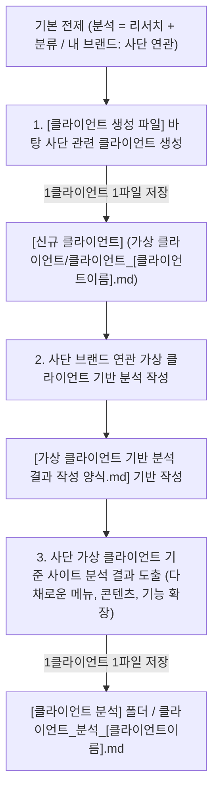

# 📌 PART 1. 클라이언트 자동화 3단계 프로세스 & 운영 규칙

본 문서는 분석(리서치와 분류로 구성됨)의 개념과 **내 브랜드 '사단 (士團)'**을 최우선 기준으로 삼고, `[클라이언트 생성 파일]`을 바탕으로 사단 브랜드 관련 신규 가상 클라이언트를 자동 생성하며, 레퍼런스 분석 데이터를 기준으로 웹사이트 분석 결과를 도출하고 정형화된 보고서로 저장하는 통합 자동화 워크플로우를 정의합니다.

> [!IMPORTANT]
> **📢 핵심 원칙 0: 분석의 정의 (Analysis Definition)**
> - 분석은 기본적으로 **리서치와 분류**로 이루어져 있습니다.
> 
> **📢 핵심 원칙 1: 내 브랜드 = '사단(士團)' 브랜드 관련성 원칙 (Brand Context Alignment)**
> - 전체 분석 및 클라이언트 생성의 최우선 기준은 **내 브랜드인 '사단 (士團)'**(조선 암행어사 마패 헤리티지, 커스텀 레이어링 향수, 포터블 오브제 자사몰)입니다.
> - 가상 클라이언트는 엉뚱한 타 업종 브랜드가 아닌, **반드시 '사단 (士團)' 브랜드 프로젝트와 직접 관련/연관된 요구사항 및 담당 클라이언트(담당자/기획자)**로 도출되어야 합니다.
> 
> **📢 핵심 원칙 2: 1 클라이언트 = 1 파일 (Single File Per Client)**
> - 모든 가상 클라이언트 생성물 및 사이트 분석 보고서는 **클라이언트 하나당 반드시 단 하나의 독립된 파일**로 생성하고 저장해야 합니다.
> 
> **📢 핵심 원칙 3: 파일명 뒤 클라이언트 이름 부착 (Client Person Name in Filename)**
> - 파일명 뒤에는 브랜드명이 아닌 **클라이언트의 이름(담당자/기획자 사람 이름)**을 부착합니다.
> - 생성 예시: `클라이언트_[클라이언트이름].md` (예: `클라이언트_한유진.md`), `클라이언트_분석_[클라이언트이름].md` (예: `클라이언트_분석_한유진.md`)
> 
> **📢 핵심 원칙 4: 풍부하고 입체적인 메뉴·콘텐츠·기능 계층 구조 (Rich IA Component Structure)**
> - 분석 보고서 작성 및 계층 구조(IA) 수립 시 단조로운 단일 항목 구성을 배제하고, **메뉴, 콘텐츠, 기능 요소 각각을 다채롭고 풍부하게(각 5~10개 이상) 구체화하여 하위 트리에 세분화 배치**해야 합니다.

---

## 1단계: 사단 브랜드 기준 [클라이언트 생성 파일] 바탕으로 클라이언트 생성

1. **기반 파일 (입력):**
   - `가상 클라이언트/클라이언트 생성 파일/` 폴더
     - `브랜드_정체성.md` / `브랜드_정체성_skill.md`
     - `인터뷰.md` / `인터뷰_skill.md`
     - `클라이언트_예시.md` / `클라이언트_예시_skill.md`

2. **수행 규칙:**
   - **사단 브랜드 기준 수립:** 내 브랜드인 **'사단 (士團)'**(조선 암행어사 마패 헤리티지 커스텀 향수 자사몰)을 기본으로 사단 브랜드의 1·2·3마패 모듈, 어사 비밀 첩보 레시피, 디스커버리 키트 요구사항을 구성합니다.
   - 기존에 생성된 클라이언트는 다시 재사용하지 않는 **일회성 생성 원칙**을 엄격히 준수합니다.
   - 사단 브랜드 내의 다양한 클라이언트 관점(브랜드 디렉터, 글로벌 마케터, 팝업/굿즈 기획자 등)을 바탕으로 100% 신규 요구사항 브리프를 생산합니다.
   - **1 클라이언트 1 파일 원칙:** 생성된 클라이언트는 독자적인 1개의 전용 파일로 작성합니다.

3. **저장 위치 및 파일명 규칙:**
   - **저장 위치:** `가상 클라이언트/클라이언트 모음/클라이언트_[클라이언트이름].md`
   - **파일명 형식:** 파일 이름 뒤에 **사단 브랜드 관련 클라이언트의 이름(사람 이름)**을 명확히 부착합니다. (예: `클라이언트_한유진.md`, `클라이언트_김도현.md`, `클라이언트_이수진.md`)

---

## 2단계: 가상 클라이언트 기반 분석 작성

1. **분석 개념 적용:**
   - 분석 작업은 기본적으로 **리서치와 분류**로 이루어져 있음을 명시하고 활용합니다.

2. **기본 설정 도출:**
   - 1단계에서 생성된 사단 브랜드 관련 `[가상 클라이언트]` 데이터를 작동 기반으로 삼아 **사단 브랜드 가상 클라이언트의 기본 설정**(프로젝트 주제, 제작 목적, 제공 자료, 필요 정보/기능, 중요도, 적용 매체)을 도출합니다.

3. **분석 결과물 작성 양식 (출력 기준):**
   - `가상 클라이언트 기반 분석 결과 작성 양식.md` (`리서치, 분석, 분류/가상 클라이언트 기반 분석 결과 작성 양식.md`)를 기반으로 결과물을 작성합니다.
   - 9단계 분석 프로세스(기본 정보 → 요구사항 수집 → 정보 단위 변환 → 분류 → IA 계층 구조 → 레이블링 → 내비게이션 → 와이어프레임 → 대조 검토)를 거쳐 표준 6대 작성 양식 구조로 완성합니다.

---

## 3단계: 사이트 분석 결과 도출 및 파일 저장

1. **분석 기준:**
   - 사이트 분석 및 벤치마킹 분석의 최우선 기준은 1단계에서 도출된 **'사단 (士團)' 가상 클라이언트**의 요구사항과 정체성으로 삼습니다.

2. **풍부한 핵심 출력 데이터 규칙 (다채로운 메뉴, 콘텐츠, 기능):**
   - 사이트 분석 결과는 반드시 **“메뉴, 콘텐츠, 기능”** 3대 축을 풍부하고 입체적으로 분해하여 출력합니다:
     - **메뉴 (Menu):** 7~9개 상위 메뉴(About Sadan, Lineup, Custom Lab, Discovery, Lookbook, Sustainability, Journal 등) 및 2~3단계 세부 하위 메뉴 트리
     - **콘텐츠 (Content):** 4K 히어로 필름, 마패 스토리 서사, 노트별 피라미드 그래프, 백꾸 룩북 갤러리, 화해 비건 성분표, 카트리지 리필 가이드, IFRA 인증 데이터, FAQ 등 10개 이상의 다채로운 콘텐츠
     - **기능 (Feature):** 탭 전환 카드 UI, 3D 실시간 각인 프리뷰어, 향 노트 검색 필터, 온라인 커스텀 믹싱 시뮬레이터, 사전 신청 폼, 론칭 카운트다운 타이머, Sticky Floating Quick CTA, 아코디언 UI, 언어 스위처 등 10개 이상의 입체적 기능

3. **저장 위치 및 파일 이름 규칙:**
   - **저장 폴더:** `[클라이언트 분석]` 폴더 (경로: `가상 클라이언트/클라이언트 분석/` 또는 `리서치, 분석, 분류/클라이언트 분석/`)
   - **파일명 형식:** `클라이언트_분석_[클라이언트이름].md` (예: `클라이언트_분석_한유진.md`, `클라이언트_분석_김도현.md`, `클라이언트_분석_이수진.md`)
   - **이름 부착 규칙:** 사단 브랜드 관련 **클라이언트 사람 이름**을 파일명 뒤에 부착하여 1 클라이언트당 1개의 독립 파일로 저장합니다.

---
---

# 📌 PART 2. 대표 자동화 분석 결과물 샘플 (Reference Sample: 한유진)

*(사단 브랜드 한유진 디렉터 가상 클라이언트 분석 보고서 예시)*

