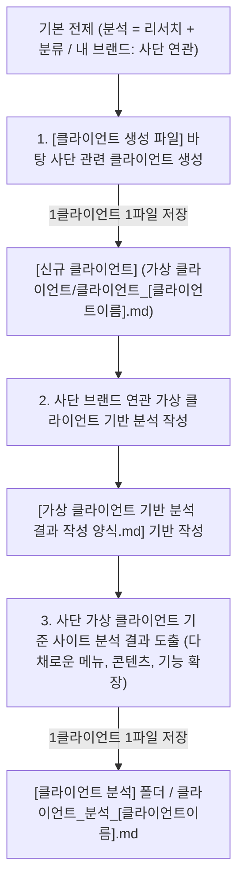

# 클라이언트 자동화 통합 실행 스킬 (클라이언트_자동화_skill.md)

---

## 0. 스킬 개요 및 원칙
* **스킬 목적:** `클라이언트_자동화.md` 명세에 정의된 3단계 클라이언트 자동화 워크플로우를 순차적으로 실행한다.
* **기반 가이드:** `클라이언트_자동화.md`
* **핵심 원칙:**
  1. **분석의 구성 정의:** 분석은 기본적으로 **리서치와 분류**로 이루어져 있다.
  2. **내 브랜드 = '사단(士團)' 관련성 원칙:** 모든 가상 클라이언트는 내 브랜드인 **'사단 (士團)' 브랜드 프로젝트와 직접 관련/연관된 클라이언트/담당자**로 생산한다.
  3. **파일명 뒤 클라이언트 이름 부착:** 파일명 뒤에는 브랜드명이 아니라 **사단 관련 클라이언트 사람 이름**을 부착한다.
  4. **1 클라이언트 = 1 파일 원칙:** 클라이언트 하나당 반드시 하나의 독립된 전용 파일로 작성한다.
  5. **다채로운 메뉴, 콘텐츠, 기능 계층 구조 수립:** 단조로운 구성을 지양하고, **메뉴, 콘텐츠, 기능 요소를 각각 5~10개 이상 풍부하게 확장하여 세분화된 IA 트리 및 와이어프레임 구조**를 도출한다.

---

## 1. 3단계 실행 프로세스 명세

### [ Step 1 ] 사단 브랜드 기준 신규 클라이언트 생성 (1 Client = 1 File)
1. **참조 입력 파일:** `가상 클라이언트/클라이언트 생성 파일/` (`브랜드_정체성.md`, `인터뷰.md`, `클라이언트_예시.md` 및 관련 skill 파일들)
2. **동작 수행:** 사단 브랜드 헤리티지(조선 암행어사 마패, 1·2·3마패, 어사 비밀 첩보, 디스커버리 키트)를 기준으로 100% 신규 가상 클라이언트를 생산한다.
3. **저장 실행:** 생성된 클라이언트는 클라이언트 사람 이름을 파일명 뒤에 붙여 `가상 클라이언트/클라이언트 모음/클라이언트_[이름].md`에 독립 저장한다.

---

### [ Step 2 ] 가상 클라이언트 기반 분석 작성 (사단 브랜드 관련)
1. **분석 개념 적용:** 분석은 리서치와 분류로 구성되어 있음을 명시한다.
2. **기본 설정 도출:** 1단계에서 생성된 사단 브랜드 관련 `[가상 클라이언트]` 데이터를 로드하여 **사단 브랜드 가상 클라이언트 기본 설정**(프로젝트 주제, 제작 목적, 제공 자료, 필요 정보/기능, 중요도, 적용 매체)을 도출한다.
3. **작성 양식 기반 작성:** `가상 클라이언트 기반 분석 결과 작성 양식.md`를 기준으로 9단계 분석 프로세스를 수행하여 결과물을 작성한다.

---

### [ Step 3 ] 사이트 분석 결과 도출 및 저장 (다채로운 메뉴, 콘텐츠, 기능)
1. **분석 기준:** 1단계에서 생성된 **'사단 (士團)' 가상 클라이언트**를 분석의 최우선 기준으로 삼는다.
2. **풍부한 핵심 출력 데이터 (입체적 구조화):**
   - **메뉴 (Menu):** 7~9개 상위 메뉴(About Sadan, Lineup, Custom Lab, Discovery, Lookbook, Sustainability, Journal 등) 및 2~3단계 세부 하위 메뉴
   - **콘텐츠 (Content):** 4K 히어로 필름, 마패 스토리 서사, 노트별 피라미드 그래프, 백꾸 룩북 갤러리, 화해 비건 성분표, 카트리지 리필 가이드, IFRA 인증 데이터, FAQ 등 10개 이상의 다채로운 콘텐츠
   - **기능 (Feature):** 탭 전환 카드 UI, 3D 실시간 각인 프리뷰어, 향 노트 검색 필터, 온라인 커스텀 믹싱 시뮬레이터, 사전 신청 폼, 론칭 카운트다운 타이머, Sticky Floating Quick CTA, 아코디언 UI, 언어 스위처 등 10개 이상의 입체적 기능
3. **저장 위치 및 파일명 규칙:**
   - **저장 폴더:** `가상 클라이언트/클라이언트 분석/` (`[클라이언트 분석]` 폴더)
   - **파일명 형식:** `클라이언트_분석_[클라이언트이름].md` (예: `클라이언트_분석_한유진.md`, `클라이언트_분석_김도현.md`, `클라이언트_분석_이수진.md`)

---

## 2. 검증 체크리스트

- [ ] **메뉴, 콘텐츠, 기능 풍부화:** 계층 구조 및 분석 결과에 메뉴/콘텐츠/기능 요소가 각각 5~10개 이상 구체화되어 확장되었는가?
- [ ] **분석 전제 및 사단 브랜드 관련성:** 분석이 리서치와 분류로 구성되어 있으며 내 브랜드인 '사단 (士團)'과 직접 연관되어 작성되었는가?
- [ ] **클라이언트 사람 이름 부착:** 파일명 뒤에 **사단 클라이언트 사람 이름**이 부착되었는가?
- [ ] **1 클라이언트 1 파일 원칙:** 클라이언트당 1개의 전용 독립 파일로 생성되었는가?
