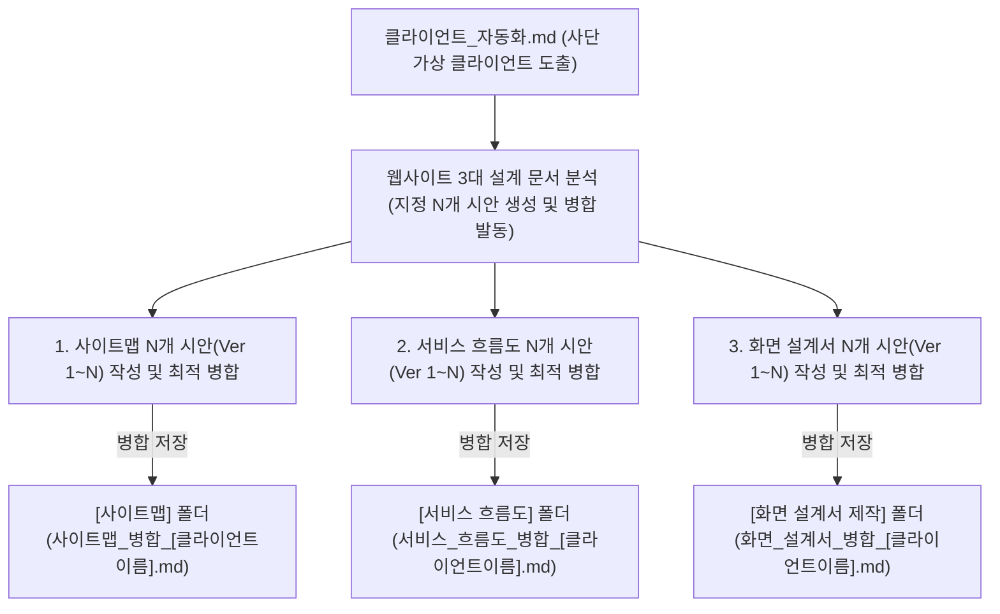
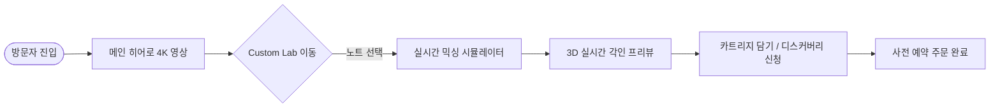

# 📌 PART 1. 클라이언트 웹사이트 생성 프로세스 & 저장 명세 (클라이언트_프로세스_자동화.md)

본 문서는 `클라이언트_자동화.md` 파이프라인을 거쳐 도출된 **내 브랜드 '사단 (士團)' 가상 클라이언트**를 바탕으로, 웹사이트 제작에 필요한 3대 핵심 설계 영역(`사이트맵`, `서비스 흐름도`, `화면 설계서`)에 대해 **사용자가 실행 시 지정한 N개(예: 3개, 5개 등)의 다각도 시안(Ver 1~N)을 기획·비교하고 최적의 결과를 병합**하여, 정해진 파일명(`사이트맵_병합_[클라이언트이름].md`, `서비스_흐름도_병합_[클라이언트이름].md`, `화면_설계서_병합_[클라이언트이름].md`)과 지정 폴더 경로에 맞춰 자동 도출·저장하는 통합 생성 명세서입니다.

> [!IMPORTANT]
> **📢 핵심 원칙 1: 내 브랜드 = '사단 (士團)' 맥락 유지 원칙**
> - 분석 대상 클라이언트는 `클라이언트_자동화.md`를 통해 생성된 조선 암행어사 마패 헤리티지, 커스텀 향수 레이어링 브랜드 **'사단 (士團)' 프로젝트 클라이언트**이어야 합니다.
> 
> **📢 핵심 원칙 2: 사용자 지정 N개 시안 기획 및 최적 병합 원칙 (N Variations & Optimal Merge)**
> - 사용자가 실행 시 인수로 전달한 시안 개수 N(예: `3개 분석`, `5개 분석` 등, 미지정 시 기본 3~5개 적용)만큼 가상 클라이언트 하나당 `사이트맵`, `서비스 흐름도`, `화면 설계서` 3개 영역 각각에 대해 **N가지 서로 다른 접근 방식의 시안(Ver 1~N)**을 도출하고, 이들의 장점을 대조·분석하여 **최적의 병합 결과물 1개**를 최종 생성합니다.
> 
> **📢 핵심 원칙 3: 병합 문서 이름 + 클라이언트 이름 부착 규칙**
> - 각 파일 이름은 병합 문서 식별자 뒤에 **클라이언트의 이름(담당자/기획자 사람 이름)**을 부착합니다.
> - **파일명 형식:** `사이트맵_병합_[클라이언트이름].md`, `서비스_흐름도_병합_[클라이언트이름].md`, `화면_설계서_병합_[클라이언트이름].md`
> 
> **📢 핵심 원칙 4: 지정 폴더 저장 규칙 (Folder Mapping)**
> - **사이트맵 병합 분석물:** `[사이트맵]` 폴더에 저장 (예: `[사이트맵]/사이트맵_병합_[클라이언트이름].md` 또는 `전체 사이트맵/[클라이언트폴더]/사이트맵/`)
> - **서비스 흐름도 병합 분석물:** `[서비스 흐름도]` 폴더에 저장 (예: `[서비스 흐름도]/서비스_흐름도_병합_[클라이언트이름].md` 또는 `전체 사이트맵/[클라이언트폴더]/서비스_흐름도/`)
> - **화면 설계서 병합 분석물:** `[화면 설계서 제작]` 폴더에 저장 (예: `[화면 설계서 제작]/화면_설계서_병합_[클라이언트이름].md` 또는 `전체 사이트맵/[클라이언트폴더]/화면_설계서/`)
> 
> **📢 핵심 원칙 5: 풍부한 3대 축 구조화 (메뉴, 콘텐츠, 기능)**
> - 각 병합 분석 파일은 단조로운 구성을 배제하고 **상위/하위 메뉴, 10개 이상의 다채로운 콘텐츠, 10개 이상의 입체적 기능 요소**를 명확히 세분화하여 포함해야 합니다.



---

## 1단계: 입력 클라이언트 및 요구사항 분석

1. **기반 클라이언트 파일 참조:**
   - `가상 클라이언트/클라이언트 모음/클라이언트_[클라이언트이름].md`
   - `가상 클라이언트/클라이언트 분석/클라이언트_분석_[클라이언트이름].md`
2. **분석 기준 및 핵심 과제 추출:**
   - 클라이언트의 브랜드 담당자 관점(글로벌 마케팅, 커스텀 믹싱 팝업, 멤버십 혜택, 굿즈 기획 등)을 파악합니다.
   - 프로젝트 목적, 주요 요구 기능, 타깃 사용자 경험, 적용 매체를 정리합니다.

---

## 2단계: 3대 핵심 웹사이트 분석 문서 도출 (N개 시안 기획 & 최적 병합)

### 1. 사이트맵 병합 분석 (`사이트맵_병합_[클라이언트이름].md`)
- **분석 및 병합 목적:** 
  - 클라이언트 요구사항을 충족하기 위해 **지정된 N개의 서로 다른 구조의 사이트맵 시안(Ver 1 ~ Ver N)**을 작성합니다. (예: 사용자 여정 중심, 상품/라인업 중심, 커스텀 조향 체험 중심, 스토리 디깅 중심, 모바일/글로벌 최적화 중심 등)
  - N개 시안의 메뉴 배치, IA 효율성, 클릭 깊이를 비교·분석하여 최적의 요소를 조합한 **최종 병합 사이트맵**을 도출합니다.
- **출력 구성요소:**
  - N개 사이트맵 시안 개요 및 특징 비교표 (Ver 1~N)
  - 최종 병합 GNB / LNB / Footer Menu
  - Depth 1 ~ Depth 3 메뉴 계층 구조 (7~9개 상위 메뉴 및 2~3단계 하위 메뉴)
  - 메뉴별 정보 유형 (사실 / 개념 / 절차 / 과정) 및 우선순위
- **저장 위치:** `[사이트맵]` 폴더
- **파일명 형식:** `사이트맵_병합_[클라이언트이름].md` (예: `사이트맵_병합_한유진.md`, `사이트맵_병합_김도현.md`)

---

### 2. 서비스 흐름도 병합 분석 (`서비스_흐름도_병합_[클라이언트이름].md`)
- **분석 및 병합 목적:** 
  - 메인 진입부터 브랜드 스토리 탐색, 커스텀 향수 믹싱, 시뮬레이션, 주문 및 사전 예약 신청까지의 흐름에 대해 **지정된 N개의 서로 다른 유저 플로우 시안(Ver 1 ~ Ver N)**을 작성합니다. (예: 빠른 예약 직진형, 인터랙티브 체험 우선형, 스토리텔링 탐색형, 맞춤 추천 진단형, 글로벌 1-Click 회원/신청형 등)
  - N개 유저 플로우의 전환율, 이탈 위험 구간, 데이터 전달 명확성을 비교하여 가장 자연스러운 **최종 병합 서비스 흐름도**를 도출합니다.
- **출력 구성요소:**
  - N개 서비스 흐름 시안 비교 및 최적 병합 가이던스 (Ver 1~N)
  - 사용자 세션별 탐색 시나리오 (신규 방문자 / 커스텀 조향 신청자 / 기존 회원)
  - 주요 페이지 간 전환 조건 및 데이터 입출력 이벤트
  - Mermaid 기반 통합 Service Flowchart (시작 ➔ 진입 ➔ 조향 시뮬레이터 ➔ 결제/신청 ➔ 완료)
- **저장 위치:** `[서비스 흐름도]` 폴더
- **파일명 형식:** `서비스_흐름도_병합_[클라이언트이름].md` (예: `서비스_흐름도_병합_한유진.md`, `서비스_흐름도_병합_김도현.md`)

---

### 3. 화면 설계서 병합 분석 (`화면_설계서_병합_[클라이언트이름].md`)
- **분석 및 병합 목적:** 
  - 주요 화면 영역 배치 및 인터랙션 요소에 대해 **지정된 N개의 서로 다른 화면 와이어프레임 시안(Ver 1 ~ Ver N)**을 작성합니다. (예: 비주얼 히어로 중심, 모듈형 그리드 중심, 3D 인터랙티브 커스텀 중심, 정보 전달 카드형, 스티키 CTA 모바일 중심 등)
  - N개 화면 시안의 시각적 몰입도, 레이아웃 균형, CTA 접근성을 종합하여 **최종 병합 화면 설계서**를 도출합니다.
- **출력 구성요소:**
  - N개 화면 설계 시안 비교 및 최적 구성요소 선정표 (Ver 1~N)
  - **[필수] 5대 다이내믹 레이아웃 아키텍처 적용:** 클라이언트의 비즈니스 성격에 따라 아래 5가지 타입 중 최적 레이아웃 아키텍처를 선택 적용하여 화면 구도를 100% 다변화
    - **Type A (벤토 그리드 모듈 레이아웃):** 비대칭 2x2/1x2 타일 결합 팝업 & 굿즈 백꾸 전용 (예: 강현우)
    - **Type B (단계별 위저드 가이드 레이아웃):** 3-Step 슬라이드 앱 카드 UI & 프로그레스 바 AI 스마트 랩 전용 (예: 백소율)
    - **Type C (분할 스크롤 듀얼 레이아웃):** 50% 고정 뷰어 + 50% 스크롤 아틀리에 글로벌 럭셔리 전용 (예: 윤서진)
    - **Type D (종단형 에디토리얼 매거진 레이아웃):** 무형문화재 아카이브 도록 스타일
    - **Type E (하단 시트 모바일 앱 레이아웃):** 1-Click QR 및 모바일 전용 뷰어
  - **[필수] 클라이언트 기반 전용 제품 전시 구간 (Product Showcase Section):** 각 클라이언트의 비즈니스 모델에 특화된 실물 제품 쇼케이스 UI 영역을 메인 화면 핵심 배치 항목으로 명시
  - **10개 이상의 콘텐츠 요소:** 4K 히어로 필름, 1·2·3 마패 스토리, 노트 피라미드, 백꾸 룩북, 화해 성분표, IFRA 인증표 등
  - **10개 이상의 기능 요소:** 3D 각인 프리뷰어, 탭 전환 카드 UI, 향 노트 검색 필터, 론칭 카운트다운 타이머, Sticky Floating CTA 등
- **저장 위치:** `클라이언트 통합/[클라이언트이름]/4_화면_설계서/`
- **파일명 형식:** `화면_설계서_병합_[클라이언트이름].md` (예: `화면_설계서_병합_강현우.md`, `화면_설계서_병합_백소율.md`)

---

## 3단계: 폴더 맵핑 및 파일 저장 규칙 (개별 시안 1~N + 최적 병합 파일 분리)

| 문서 종류 | 개별 시안 결과물 (Ver 1~N) | 최종 최적 병합 결과물 | 이미지 연동 규칙 |
| :--- | :--- | :--- | :--- |
| **사이트맵** | `사이트맵_시안1_[이름].md`<br>`사이트맵_시안2_[이름].md`<br>`사이트맵_시안3_[이름].md` | `사이트맵_병합_[이름].md`<br>`사이트맵_병합_[이름].mmd`<br>`사이트맵_병합_[이름].svg` | **[최적 병합 파일 단 1곳만 이미지 연동]**<br>`사이트맵_병합_[이름].md` 상단에만 `` 태그 연결 |
| **서비스 흐름도** | `서비스_흐름도_시안1_[이름].md`<br>`서비스_흐름도_시안2_[이름].md`<br>`서비스_흐름도_시안3_[이름].md` | `서비스_흐름도_병합_[이름].md`<br>`서비스_흐름도_병합_[이름].mmd`<br>`서비스_흐름도_병합_[이름].svg` | **[최적 병합 파일 단 1곳만 이미지 연동]**<br>`서비스_흐름도_병합_[이름].md` 상단에만 `` 태그 연결 |
| **화면 설계서** | `화면_설계서_시안1_[이름].md`<br>`화면_설계서_시안2_[이름].md`<br>`화면_설계서_시안3_[이름].md` | `화면_설계서_병합_[이름].md` | Header/Body/Aside/Footer 5대 영역 및 10+ 콘텐츠/기능 세분화 명세 |

- **`클라이언트 통합/[이름]/` 전용 저장 경로 규칙:**
  - 모든 설계 파일은 **`클라이언트 통합/[클라이언트이름]/` 하위 서브 폴더에 단일 지정 저장**한다:
    - 사이트맵 결과물 ➔ `클라이언트 통합/[클라이언트이름]/2_사이트맵/` (`사이트맵_시안1~3_[이름].md`, `사이트맵_병합_[이름].md`, `.mmd`, `.svg`)
    - 서비스 흐름도 결과물 ➔ `클라이언트 통합/[클라이언트이름]/3_서비스_흐름도/` (`서비스_흐름도_시안1~3_[이름].md`, `서비스_흐름도_병합_[이름].md`, `.mmd`, `.svg`)
    - 화면 설계서 결과물 ➔ `클라이언트 통합/[클라이언트이름]/4_화면_설계서/` (`화면_설계서_시안1~3_[이름].md`, `화면_설계서_병합_[이름].md`)

---

## 4단계: 최종 검증 체크리스트

- [ ] **개별 시안과 병합 파일의 분리 도출:** 각 설계 영역별로 개별 시안 파일(`시안1`, `시안2`, `시안3`)과 최적 병합 파일(`병합`)이 각각 독립된 파일로 도출되었는가?
- [ ] **단일 최적 병합 파일 1곳 이미지 연동:** 시각화 SVG 이미지가 개별 시안 파일에는 포함되지 않고, 오직 **최종 병합 결과물 파일(`병합_[이름].md`) 단 1곳에만** 이미지 태그로 연결되었는가?
- [ ] **3종 세트(.md, .mmd, .svg) 병합 생성:** 최적 병합 파일 작성 시 `.md` 본문, 순수 다이어그램 소스 `.mmd`, 벡터 이미지 차트 `.svg` 3종 세트가 올바르게 생성되었는가?
- [ ] **`클라이언트 통합/[이름]/` 저장 준수:** `클라이언트 통합/[클라이언트이름]/` 전용 폴더 및 서브 폴더 저장을 올바르게 준수하였는가?
- [ ] **사단 브랜드 맥락 반영:** 조선 암행어사 마패 헤리티지, 커스텀 향수 레이어링 등 브랜드 콘텍스트가 일관되게 유지되었는가?

---
---

# 📌 PART 2. 대표 자동화 웹사이트 분석 결과물 샘플 (한유진 클라이언트, N=3 시안 예시)

### 1. [사이트맵] 폴더 / `사이트맵_병합_한유진.md` 샘플
```markdown
# [사단(士團)] 한유진 클라이언트 사이트맵 병합 분석 보고서 (3개 시안 병합)

## 1. 3개 사이트맵 시안 기획 및 최적 병합 개요
- **Ver 1 (사용자 여정 중심):** 메인 ➔ 체험 ➔ 구매 중심의 선형 구조
- **Ver 2 (라인업 중심):** 1·2·3 마패 상품 카테고리 강조 구조
- **Ver 3 (커스텀 조향 중심):** Custom Lab 조향 시뮬레이터 중심 구조
- **▶ 최적 병합 결론:** Ver 3의 조향 시뮬레이터와 Ver 2의 라인업 구조를 결합하여 최적의 IA 수립

## 2. GNB & 전체 메뉴 계층 구조 (IA)
- 1.0 About Sadan (사단 스토리)
  - 1.1 암행어사 마패 헤리티지
  - 1.2 어사 비밀 첩보 레시피
- 2.0 Lineup (제품 라인업)
  - 2.1 1마패 초급자 오드파퓸
  - 2.2 2마패 중급자 커스텀 키트
  - 2.3 3마패 어사 마스터 라인
- 3.0 Custom Lab (조향 시뮬레이터)
  - 3.1 노트 믹싱 실시간 시뮬레이션
  - 3.2 3D 실시간 마패 각인 프리뷰
- 4.0 Discovery & Journal
  - 4.1 시향 디스커버리 키트 신청
  - 4.2 백꾸 룩북 갤러리
```

### 2. [서비스 흐름도] 폴더 / `서비스_흐름도_병합_한유진.md` 샘플
```markdown
# [사단(士團)] 한유진 클라이언트 서비스 흐름도 병합 분석 보고서 (3개 시안 병합)

## 1. 3개 서비스 흐름 시안 기획 및 최적 병합 개요
- **Ver 1~3 시안 검토:** 빠른 예약형, 인터랙티브 믹싱형, 스토리 탐색형
- **▶ 최적 병합 결론:** 메인 진입 후 인터랙티브 믹싱 시뮬레이션 및 3D 각인 프리뷰를 거쳐 사전 예약을 완료하는 하이브리드 유저플로우 채택

## 2. 사용자 주요 서비스 플로우 (User Flow)

```

### 3. [화면 설계서 제작] 폴더 / `화면_설계서_병합_한유진.md` 샘플
```markdown
# [사단(士團)] 한유진 클라이언트 화면 설계서 병합 분석 보고서 (3개 시안 병합)

## 1. 3개 화면 설계 시안 기획 및 최적 병합 개요
- **Ver 1~3 시안 검토:** 비주얼 히어로 중심, 모듈 그리드 중심, 3D 인터랙티브 커스텀 중심
- **▶ 최적 병합 결론:** 4K 히어로 필름 Header + 3D 실시간 각인 및 노트 피라미드 Body + Sticky Floating CTA 결합

## 2. 와이어프레임 화면 영역 및 10대 주요 기능/콘텐츠
- **Header:** 로고, GNB 스위처, 언어 선택, Quick Cart CTA
- **Body Area (Core Content & Feature):**
  1. 4K 히어로 필름 비디오
  2. 1·2·3마패 인터랙티브 탭 카운터
  3. 3D 실시간 각인 프리뷰어
  4. 향 노트 피라미드 아코디언 UI
  5. 론칭 카운트다운 타이머
  6. 백꾸 룩북 그리드 갤러리
  7. 화해 비건 인증 성분표 Modal
  8. IFRA 국제 인증 데이터 팝업
  9. 카트리지 리필 가이드 탭 UI
  10. Sticky Floating 사전신청 CTA
- **Footer:** CS Center, 브랜드 사회적 가치, 카피라이트, SNS 링크
```
