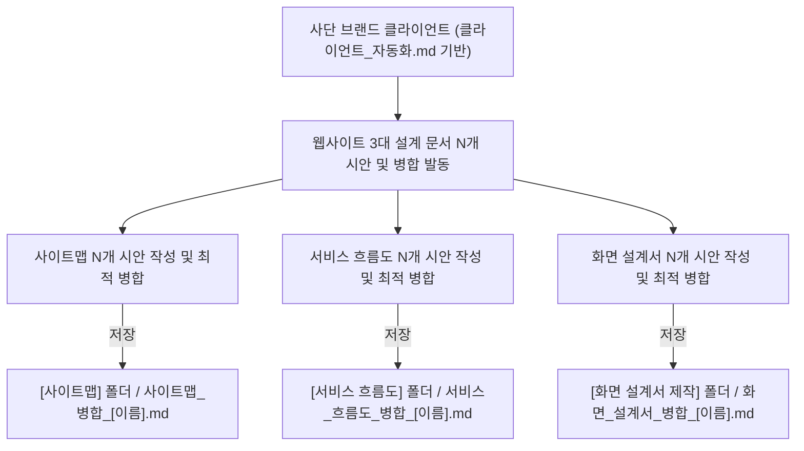

# 클라이언트 웹사이트 생성 스킬 (클라이언트_프로세스_자동화_skill.md)

---

## 0. 스킬 개요 및 핵심 원칙
* **스킬 목적:** `클라이언트_프로세스_자동화.md` 명세에 정의된 3대 웹사이트 설계 영역별 사용자 지정 N개 시안 기획, 최적 요소 병합 및 지정 폴더 저장 자동화 워크플로우를 순차적으로 실행한다.
* **기반 가이드:** `클라이언트_자동화.md` ➔ `클라이언트_프로세스_자동화.md`
* **핵심 원칙:**
  1. **사단 브랜드 맥락 고정:** 대상 클라이언트는 '사단 (士團)' 브랜드 프로젝트 클라이언트 데이터를 기반으로 실행한다.
  2. **사용자 지정 N개 시안 기획 & 최적 병합:** 클라이언트 1명당 실행 시 지정된 N개(예: 3개 분석, 5개 분석 등, 미지정 시 기본 N개)의 시안(Ver 1~N)을 기획·대조한 후 최적 요소를 병합한 단 하나의 독립 병합 md 문서를 도출한다.
  3. **개별 시안(Ver 1~N) & 최적 병합 파일 분리 생성:** 
     - 개별 시안: `[문서명]_시안1_[이름].md`, `[문서명]_시안2_[이름].md`, `[문서명]_시안3_[이름].md` (텍스트/Mermaid 본문)
     - 최적 병합: `[문서명]_병합_[이름].md`, `.mmd`, `.svg` 3종 세트
  4. **단일 최적 병합 파일 SVG 이미지 연동 규칙:**
     - 개별 시안 파일에는 이미지를 연동하지 않음
     - 오직 **최적 병합 파일(`사이트맵_병합_[이름].md`, `서비스_흐름도_병합_[이름].md`) 1곳에만** `` 태그 필수 연결
  5. **`클라이언트 통합/[이름]/` 전용 폴더 맵핑 저장:**
     - 모든 결과물은 **`클라이언트 통합/[이름]/` 하위 전용 서브 폴더에 단일 저장**한다:
       - 사이트맵 ➔ `클라이언트 통합/[이름]/2_사이트맵/`
       - 서비스 흐름도 ➔ `클라이언트 통합/[이름]/3_서비스_흐름도/`
       - 화면 설계서 ➔ `클라이언트 통합/[이름]/4_화면_설계서/`

---

## 1. 실행 프로세스 명세

### [ Step 1 ] 입력 클라이언트 및 시안 수(N) 확인
1. `가상 클라이언트/클라이언트 모음/클라이언트_[클라이언트이름].md` 및 `클라이언트_분석_[클라이언트이름].md` 파일 탐색
2. 해당 클라이언트의 담당자 역할, 요청사항, 커스텀 조향/마패 헤리티지 관련 핵심 미션 파악
3. 사용자가 지정한 시안 수 N(예: 3개 분석 시 N=3, 5개 분석 시 N=5)을 파악 (미지정 시 기본 3개~5개 설정)

### [ Step 2 ] 문서별 N개 시안 기획 및 병합 파일 생성
1. **사이트맵 병합 생성 (`사이트맵_병합_[이름].md`):**
   - N개 다각도 사이트맵 시안(Ver 1~N) 기획 ➔ IA 효율성 및 깊이 비교 ➔ 최적 요소 통합
   - 7~9개 상위 메뉴, 2~3단계 하위 메뉴, 계층적 IA, 정보 유형 지정
   - **저장 위치:** `[사이트맵]` 폴더
2. **서비스 흐름도 병합 생성 (`서비스_흐름도_병합_[이름].md`):**
   - N개 유저 플로우 시안(Ver 1~N) 기획 ➔ 이탈 위험 및 데이터 전달성 검토 ➔ 최적 플로우 통합
   - 사용자 진입 ➔ 탐색 ➔ 커스텀 믹싱 ➔ 3D 각인 ➔ 주문/신청 플로우 (Mermaid 포함)
   - **저장 위치:** `[서비스 흐름도]` 폴더
3. **화면 설계서 병합 생성 (`화면_설계서_병합_[이름].md`):**
   - 브랜드 웹페이지 레퍼런스 분석(`master_references`)에 기반한 6대 레이아웃 아키타입(Type 1~6) 중 최적 1개 매핑
   - N개 레이아웃 및 인터랙션 시안(Ver 1~N) 기획 ➔ 몰입도 및 CTA 접근성 비교 ➔ 최적 화면 구성 통합
   - 아키타입별 특화 DOM/Grid 구조 배치 (획일적 3:1 상하 블록 구조 전면 배제)
   - 클라이언트 맞춤 전용 실물 제품 쇼케이스(Product Showcase) 및 10개 이상의 다채로운 콘텐츠/기능 정의
   - **저장 위치:** `[화면 설계서 제작]` 폴더

---

## 2. 검증 체크리스트

- [ ] 클라이언트 1명당 3개 영역에 대해 지정된 N개(예: 3개, 5개 등)의 시안을 기획·비교하고 최적의 병합 결과물이 작성되었는가?
- [ ] 각 병합 파일명이 `사이트맵_병합_[이름].md`, `서비스_흐름도_병합_[이름].md`, `화면_설계서_병합_[이름].md` 형식인가?
- [ ] `사이트맵_병합` 분석 결과가 `[사이트맵]` 폴더에 저장되었는가?
- [ ] `서비스_흐름도_병합` 분석 결과가 `[서비스 흐름도]` 폴더에 저장되었는가?
- [ ] `화면_설계서_병합` 분석 결과가 `[화면 설계서 제작]` 폴더에 저장되었는가?
- [ ] 브랜드 웹페이지 레퍼런스 분석 데이터와 연계된 6대 레이아웃 아키타입(Type 1~6)이 정상 매핑되었는가?
- [ ] '사단' 브랜드 맥락과 N개 시안 병합 개요, 다채로운 메뉴/콘텐츠/기능 구조가 반영되었는가?

